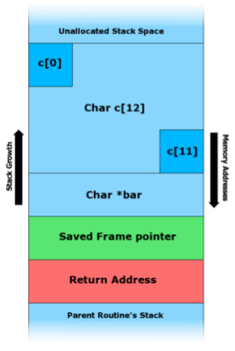

> *This week on* CS50: 
> *CS50 Library. Heap. Pointers, continued. Forensics.*

# Monday lecture

[Video](http://cs50.tv/2011/fall/lectures/5/week5m.mp4)

[Slides](http://cdn.cs50.net/2011/fall/lectures/5/week5m.pdf)

## Announcements and Demos (0:00–7:00, 9:00–12:00)

* For this week’s problem set, you’ll be implementing the popular logic game
Sudoku. If you don’t get this joke, hopefully you will by the end of the
week.

* Soon we’ll be diving into the world of forensics and data recovery. One
of David’s favorite jobs in grad school was an internship at the Middlesex
District Attorney’s office in which he assisted investigators in recovering
deleted data like e-mails, spreadsheets, and images from the hard drives
of suspects. It’s somewhat terrifying how many breadcrumbs we leave
behind when we do something as simple as check our e-mail. That being
said, shows like CSI and Law & Order have somewhat overglorified the
power of technology. For example, there is no such thing as infinite zoom:
you can’t keep zooming and enhancing forever. Furthermore, spewing a
bunch of jargon does not a computer scientist make. Jurassic Park, CSI,
and Numb3rs offer some unfortunate examples of this.

## Problem Set 4 (7:00–9:00)

* For Problem Set 4, you’ll be starting with some distribution code, as with
Problem Set 3. The goal is for you to become comfortable working with
code that you didn’t write yourself, whether it be for a job, for a partner
programming assignment, or even for the Final Project when you need to
make use of an API, an application programming interface.

* We’ve given you the code that renders the game board, but it will be up
to you to make it playable. Unlike in Problem Set 3, we won’t be very
explicit in telling you how and where to implement the pieces.

## From Last Time (12:00–45:00)

* Recall that this implementation of `swap` was buggy:

      void
      swap(int a, int b)
      {
          int tmp = a;
          a = b;
          b = tmp;
      }

  Although correct in that it swapped two inputs within its own scope, this
  function ultimately does not accomplish what we want it to because the
  swapped values are thrown away when it returns. We called this approach
  passing by value as opposed to passing by reference in which the arguments
  to swap were pointers:

      void
      swap(int *a, int *b)
      {
          int tmp = *a;
          *a = *b;
          *b = tmp;
      }

  Those asterisks make all the difference! `a` and `b` are now the memory
  addresses—not copies—of the original variables we hope to swap. We sim-
  ulated this onstage by passing scraps of paper with numbers representing
  the locations of the milk and OJ cups.

### `swap.c`

* Let’s take a look at a full example of passing variables by reference in
  swap.c:

      /*****************************************
       * swap.c
       *
       * Computer Science 50
       * David J. Malan
       *
       * Swaps two variables’ values.
       *
       * Demonstrates passing by reference.
       *****************************************/

      #include <stdio.h>

      // function prototype
      void swap(int *a, int *b);

      int
      main(void)
      {
          int x = 1;
          int y = 2;

          printf("x is %d\n", x);
          printf("y is %d\n", y);
          printf("Swapping...\n");
          swap(&x, &y);
          printf("Swapped!\n");
          printf("x is %d\n", x);
          printf("y is %d\n", y);
      }

      /*
       * Swap arguments’ values.
       */
      void
      swap(int *a, int *b)
      {
          int tmp = *a;
          *a = *b;
          *b = tmp;
      }

  In order to pass the variables x and y by reference, we use the `&` operator,
  which you can read as “address of.” The data type of `&x` and `&y` is thus
  `int *`. Pointers typically point to a single data type in particular, so
  `&x` and `&y` are pointers-to-int.

* Within `swap`, we use the dereferencing operator (`*`) to access what is in
the memory addresses stored by `a` and `b`. If we didn’t use this operator,
and instead just swapped `a` and `b` rather than *a and *b, then we would
swap memory addresses, which is not what we want.

* After the first line of `swap`, both `tmp` and `*a` are equal to 1. After the
second line, `*a` and `*b` are both equal to 2. After the third line, `*a` and
`*b` have the values 2 and 1, respectively.

* Compiling and running this program prints the following:

      x is 1
      y is 2
      Swapping...
      Swapped!
      x is 2
      y is 1

### GDB

* To examine `swap.c` more closely, we can turn to our trusty debugger GDB.
  After we execute `gdb swap` from the command line and type `break main`
  followed by `run` at the prompt, we find ourselves paused at the beginning
  of `main`’s execution:

      Breakpoint 1, main () at swap.c:22
      22      int x = 1;

  Printing `x` here gives us a garbage value since line 22 hasn’t been executed
  yet and thus `x` hasn’t been initialized. Typing `next` followed by `print x`
  gives us 1.

* If we pause on line 27, just before `swap` is called, we can print out x and
y and verify that they equal 1 and 2, respectively. Now, instead of typing
next, we’ll type `step` so that we’ll actually get to step inside `swap` instead
of stepping over it.

* Once we step inside `swap`, we can actually visualize the stack by typing
  the command `backtrace`, which gives us the following:

      #0 swap (a=0xbffff50c, b=0xbffff508) at swap.c:42
      #1 0x08048487 in main () at swap.c:28

  Here we see two frames, one for `swap` on top of one for `main`.

* At the beginning of `swap`, we can print `*a` and `*b` to confirm that they
are 1 and 2, respectively. After executing the line `*a = *b`, printing `*a`
gives the value 2. Finally, at the end of `swap`, printing `*a` and `*b` gives the
values 2 and 1, respectively. Since we’ve now verified that the values are
properly swapped, we can type `continue` to run the rest of the program
as normal.

* Two takeaways here: the difference between `a` (*pointer*) and `*a`
  (*integer*) and the difference between `x` (*integer*) and `&x` (*pointer*).

* Question: do pointers have scope? Yes. `a` and `b` only exist within `swap`.

* Question: what’s the difference between `*` and `&`? The `*` has two meanings:
when declaring a variable, it denotes it as a pointer and when assigning to a
variable, it dereferences the variable. The `&` is the “address of” operator.
So `&x` gives us the address of `x`, which might look like `0xbffff50c` if we
printed it out in GDB.

* Question: what consequences might there be to the garbage values stored
  in variables before we initialize them? If we declare a pointer and forget
  to initialize it, then attempting to dereference it will cause our program to
  access one of these garbage values as a memory address. Chances are that
  the garbage value isn’t a memory address that we own, so our program
  will most likely fail with a segmentation fault. The following toy program
  illustrates this:

      #include <stdio.h>
      int
      main(void)
      {
          int *p;
          printf(‘‘%d’’, *p);
      }

  Interestingly, we could modify this program as follows to avoid a
  segmentation fault:

      #include <stdio.h>

      int
      main(void)
      {
          int x = 1;
          int *p = &x;
          printf(‘‘%d’’, *p);
      }

  What we’re doing is initializing p with the address of `x` which we know to
  be valid. Now, printing `*p` and printing `x` are equivalent: they both give
  1. In fact, printing `*&x` is equivalent to printing `x` as well. The `*` and
  `&` operators invert each other.

* Now that we’ve covered pointers, you’ll hopefully understand this comic.

* Recall our depiction of the stack as a series of frames, one each for the
parameters and local variables of every function called in our program, in-
cluding main, one on top of another. We mentioned briefly that a possible
attack vector is overwhelming one of these frames with more bits than it
can handle so that they spill over into another frame.

### Comparing and Copying Strings

* In `compare1.c`, we saw that comparing strings using the `==` operator
doesn’t work because it actually compares their memory addresses, not
their contents. This is because strings are actually implemented as `char *`,
meaning a pointer-to-char, specifically the first character in the string. All
the other characters are contiguous in memory, so we can piece the string
together by iterating through them until we hit the null terminator.

* Could we compare `*s1` and `*s2` instead of `s1` and `s2`? Unfortunately, this
would only compare the first characters of each string, so we would still
get incorrect results.

* Ultimately, we solved this problem by iterating over both strings, compar-
  ing them one character at a time until we found a difference or we reached
  the end of the strings. This is, in fact, what the built-in function `strcmp`
  does, which we make use of in `compare2.c`:

      /*****************************************
       * compare2.c
       *
       * Computer Science 50
       * David J. Malan
       *
       * Compares two strings.
       *
       * Demonstrates strings as pointers to arrays.
       *****************************************/

      #include <cs50.h>
      #include <stdio.h>
      #include <string.h>

      int
      main(void)
      {
          // get line of text
          printf("Say something: ");
          char *s1 = GetString();

          // get another line of text
          printf("Say something: ");
          char *s2 = GetString();

          // try to compare strings
          if (s1 != NULL && s2 != NULL)
          {
              if (strcmp(s1, s2) == 0)
                  printf("You typed the same thing!\n");
              else
                  printf("You typed different things!\n");
          }
      }

  Notice the error checking: because we’ve peeked under the hood of the
  CS50 Library, we know that we need to check that `GetString` didn’t
  return `NULL` when we initialized `s1` and `s2`. Also, after reading the man
  page for `strcmp`, we know that `strcmp` can return positive, negative, or
  0, but only when it returns 0 are the strings equal.

* In this program, we check for `NULL` because attempting to dereference a
`NULL` pointer will cause a segmentation fault. But what about attempting
to dereference a pointer that has a non-`NULL` garbage value? The truth is,
it won’t always result in a segmentation fault. The garbage value might
be a memory address that doesn’t belong to our program, but because
there is usually some leeway given by the operating system in terms of
what memory is accessible by a program, it won’t always be obvious that
your program is flawed. Soon we’ll introduce a program called Valgrind
that will analyze your program and attempt to determine if it is misusing
memory in some way.

* In `copy2.c` we called the `sizeof` function to get the number of bytes in a
`char` even though we know that this number is 1 on most systems. In this
way, we ensured that our code will work even if this number ever changes,
as it might in the future. Consider the Y2K bug. Thinking that two digits
are all that are needed to store a year was shortsighted. In every case, you
should assume that your code will be used for decades to come so that
you will program defensively and avoid making bad assumptions.

* We also attempted to copy a string and capitalize the first letter of the
copy. In our first attempt, `copy1.c`, we failed because both of our pointers
pointed to the same memory, so changing the contents of the memory
affected both “copies.” In our second attempt, `copy2.c`, we succeeded
because we allocated a second chunk of memory separate from the first.
Then we filled this chunk of memory by copying over the characters of the
user-provided string one at a time.

## The Stack and the Heap (45:00–67:00)

* The chunk of memory that we allocated for a copy of our string came not
from the stack but from the heap. Because the stack has frames that are
constantly being added to it and removed from it, it’s not a very good
place for long-term memory storage. The heap, however, is conceptually
at the “top” of memory, away from the constantly changing stack. A few
other sections of memory worth noting: environment variables such as
your username are stored below the stack while the actual text of your
program, that is, the 0’s and 1’s, as well as uninitialized and initialized
global variables are stored above the heap.

* Recall that the heap grows downward while the stack grows upward. This,
of course, is a problem waiting to happen. We were able to make the
stack and the heap collide with our recursive function that called itself
infinitely. Generally speaking, however, as long as we are smart about
memory management, we can avoid this kind of collision.

### `bar.c`

* Let’s have a little fun with GDB and pointers in `bar.c`:

      /*****************************************
       * bar.c
       *
       * Computer Science 50
       * David J. Malan
       *
       * Offers opportunities to play with pointers with GDB.
       *****************************************/

      #include <stdio.h>

      int foo(int n);
      void bar(int m);

      int
      main(void)
      {
          int a;
          char *s = "hello, world";
          printf("%s\n", &s[7]);
          a = 5;
          foo(a);
          return 0;
      }

      int
      foo(int n)
      {
          int b;
          b = n;
          b *= 2;
          bar(b);
          return b;
      }

      void
      bar(int m)
      {
          printf("Hi, I’m bar!\n");
      }

  `a` is a local variable, so it is stored on the stack. Printing `&s[7]` as a
  string actually tells the compiler to treat the address of the 7th character
  (0-indexed) of `s` as a `char *`. When `printf` goes to this address, it finds
  the character “w” and continues iterating over the rest of s until it hits
  the null terminator. Thus, what we print is “world,” a substring of `s`. `s`
  is actually equivalent to `&s[0]`, the address of the first character of the
  string.

* The rest of `bar.c` isn’t all that interesting, but it offers us an opportunity
  to play around with GDB. After we start up GDB, we can set a breakpoint
  in `bar` by typing `break bar` followed by `run` at the prompt. Now when
  we type `backtrace`, we see the following:

      #0  bar (m=10) at bar.c: 40
      #1  0x08048449 in foo (n=5) at bar.c:33
      #2  0x0804828 in main () at bar.c:23

  This is a nice visualization of the stack, with `main` at the bottom, `foo` in
  the middle, and `bar` at the top.

* Let’s say we forgot what the value of `b` was within `foo`. Instead of restart-
ing our program and setting another breakpoint, we can actually just type
frame 1, which tells GDB to assume foo’s frame as its context. Then we
type `print b` and we see the value 10.

### The CS50 Library

* Let’s peek under the hood of the CS50 Library, particularly at `GetString`:

      /*
       * Reads a line of text from standard input and returns it as a
       * string (char *), sans trailing newline character. (Ergo, if
       * user inputs only "\n", returns "" not NULL.) Returns NULL
       * upon error or no input whatsoever (i.e., just EOF). Leading
       * and trailing whitespace is not ignored. Stores string on heap
       * (via malloc); memory must be freed by caller to avoid leak.
       */

      string
      GetString(void)
      {
          // growable buffer for chars
          string buffer = NULL;

          // capacity of buffer
          unsigned int capacity = 0;

          // number of chars actually in buffer
          unsigned int n = 0;

          // character read or EOF
          int c;

          // iteratively get chars from standard input
          while ((c = fgetc(stdin)) != ’\n’ && c != EOF)
          {
              // grow buffer if necessary
              if (n + 1 > capacity)
              {
                  // determine new capacity: start at 32 then double
                  if (capacity == 0)
                      capacity = 32;
                  else if (capacity <= (UINT_MAX / 2))
                      capacity *= 2;
                  else
                  {
                      free(buffer);
                      return NULL;
                  }

                  // extend buffer’s capacity
                  string temp = realloc(buffer, capacity * sizeof(char));
                  if (temp == NULL)
                  {
                      free(buffer);
                      return NULL;
                  }
                  buffer = temp;
              }

              // append current character to buffer
              buffer[n++] = c;
          }

          // return NULL if user provided no input
          if (n == 0 && c == EOF)
              return NULL;

          // minimize buffer
          string minimal = malloc((n + 1) * sizeof(char));
          strncpy(minimal, buffer, n);
          free(buffer);

          // terminate string
          minimal[n] = ’\0’;

          // return string
          return minimal;
      }

  To begin, we assume that the user’s input will be no more than 32 bytes
  (characters) in length. This is safe because we know we’re going to grow
  our storage in kind with the user’s input, so we might as well err on the
  lower side to begin with. We’re keeping track of both the potential size
  of the user’s input in `capacity `and the actual size of the user’s input in
  `n`. Both are of type `unsigned int` because we know that the size of the
  user’s input will never be negative.

* The function `fgetc` is grabbing one character at a time from `stdin` which
essentially represents the keyboard. We then check if that character is
the special character `EOF` which signifies that the user has finished giving
input, perhaps via the return key. At the end of the loop, we add this
character to the buffer which we’ll eventually return. What we glossed
over in the beginning were the lines of code that check if adding another
character to the buffer would overflow it and, if so, ask for more memory
for the buffer.

* In addition to `malloc`, we call `realloc` which reuses and expands the
memory we’ve already asked for. Both functions allocate memory on the
heap, not the stack.

### Buffer Overrun Attacks

* We mentioned briefly an attack vector which involves filling a stack frame
  with more data than it can handle. This attack is known as a buffer
  overrun attack. As this diagram indicates, the stack is used to store not
  only function frames and parameters, but also a function’s return address:
  
  !
  
  This way, when a function finishes executing, the program will know where
  in memory to return in order to continue.

* As you can see from this diagram, if we write more than 12 characters to
c, we’re going to first overwrite the value of `bar` followed by something
called the saved frame pointer, which allows the computer to remember
where in RAM it currently is. Next, we’ll overwrite or corrupt the return
address. If an adversary knows where on the stack this return address is,
he can overwrite it with a valid but different value which contains some
malicious code he wants to execute. Then, instead of returning to the
correct memory address, the program will jump to the malicious code
instead.

* How might a malicious user discover such a vulnerability? Trial and error,
most likely. Every time an adversary is able to crash your program with
a segmentation fault or otherwise, he has revealed a potential exploit. In
the case of a buffer overrun attack, the adversary would provide a very
long string input and observe your program’s behavior. If you failed to
check the bounds of your array that stored this string, then he might keep
providing string inputs of different length until he hit the magic length
that allowed him to overwrite your function’s return address with the
address of his malicious code.

