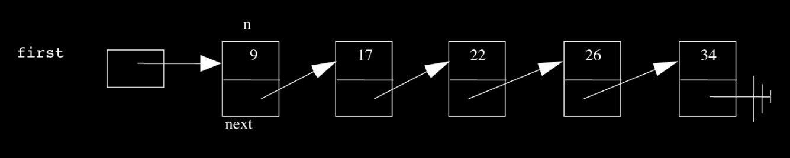

> *This week on* CS50: 
> *File I/O. Linked lists. Stacks. Queues. Valgrind. Hash tables. Trees. Binary
> search trees. Tries.*

# Monday lecture

[Video](http://cs50.tv/2011/fall/lectures/7/week7m.mp4)

[Slides](http://cdn.cs50.net/2011/fall/lectures/7/week7m.pdf)

[Notes](http://cdn.cs50.net/2011/fall/lectures/7/week7m.pdf)

## Problem Set 5 (6:00–10:00)

* Problem Set 5 will introduce you to the basics of storing images as bytes.
  If we think back to Week 0, we can think of a quick and easy way to store
  a black-and-white image. Images are composed of a series of dots, known
  as pixels, each of which has a color. If the image we want to store is black
  and white, then we can use 1 to represent white and 0 to represent black.
  Each pixel is thus stored as 1 bit. Fittingly, this type of image is called
  a bitmap. Although images these days are much more complex than this,
  this basic concept holds true: the color of a single pixel can be represented
  with some number of bits.

* In addition to the bits representing the colors of pixels, images need to
  store metadata in order that programs like Photoshop know how to inter-
  pret them. Not all of this metadata is particularly interesting, but we’ll
  explore some of it pertaining to bitmaps, e.g. `biSize` in this upcoming
  problem set.

* Incidentally, `BYTE` and `WORD` are Windows-specific data types that have
  corresponding mappings in Linux which we’ll provide for you.

* After this week, there will be no more Hacker Editions. This week, the
  Hacker Edition will challenge you not only to enlarge an image, but also
  to shrink an image. Whereas enlarging an image only requires duplicating
  information that is already there, shrinking an image requires throwing
  information away. How will you decide which pixels to keep?

## Valgrind (12:00–19:00)

* Valgrind is a tool which analyzes your code for memory mismanagement.
  It will help detect memory leaks, buffer overruns, pointer abuse, and more.
  It’s not perfect, of course, since it can’t, for example, simulate all possible
  user input, but it’s a good starting point.

* Let’s take a look at an example program, memory.c, which will show us
  how Valgrind might prove useful:

      /****************************************************************************
      * memory.c
      *
      * Computer Science 50
      * David J. Malan
      *
      * Demonstrates memory-related errors.
      *
      * problem 1: heap block overrun
      * problem 2: memory leak -- x not freed
      *
      * Adapted from
      * http://valgrind.org/docs/manual/quick-start.html#quick-start.prepare.
      ***************************************************************************/

      #include <stdlib.h>
      void
      f(void)
      {
          int *x = malloc(10 * sizeof(int));
          x[10] = 0;
      }

      int
      main(void)
      {
          f();
          return 0;
      }

  Notice that we are allocating 40 bytes for an array of int and then
  improperly storing an integer at index 10, which overwrites the null
  terminator.

  Off-by-one errors like these won’t always be immediately obvious since
  your program may not segfault or even complain. However, Valgrind will
  reveal both of this bugs to us:

      valgrind ./memory

      ==2257== Invalid write of size 4
      ==2257==
      at 0x804840F: f (memory.c:23)
      ==2257==
      by 0x8048421: main (memory.c:30)
      ==2257== Address 0x4275050 is 0 bytes after a block of size 40 alloc’d
      ==2257==
      at 0x4025D69: malloc (vg_replace_malloc.c:236)
      ==2257==
      by 0x8048405: f (memory.c:22)
      ==2257==
      by 0x8048421: main (memory.c:30)
      ==2257== LEAK SUMMARY:
      ==2257==
      definitely lost: 40 bytes in 1 blocks
      ==2257==
      indirectly lost: 0 bytes in 0 blocks
      ==2257==
      possibly lost: 0 bytes in 0 blocks
      ==2257==
      still reachable: 0 bytes in 0 blocks
      ==2257==
      suppressed: 0 bytes in 0 blocks
      ==2257== Rerun with --leak-check=full to see details of leaked memory

  Valgrind gives us a large amount of output when we run it, but the part
  that we care about is excerpted above. This excerpt tells us that at line 23,
  we wrote 4 bytes (i.e. an int) improperly. This accords with our previous
  analysis of memory.c which indicated that we were touching memory past
  the bounds of the array x.

* The excerpt above also tells us that 40 bytes of memory are “definitely
  lost.” This alludes to a memory leak. Valgrind recommends that we run
  with the option `--leak-check=full` and when we do, we get this extra
  chunk of output:

      ==2257== 40 bytes in 1 blocks are definitely lost in loss record 1 of 1
      ==2257==
      at 0x4025D69: malloc (vg_replace_malloc.c:236)
      ==2257==
      by 0x8048405: f (memory.c:22)
      ==2257==
      by 0x8048421: main (memory.c:30)

  This tells us that the error occurred within `malloc`, but we know that’s
  probably not exactly true. If we go up one more frame on this stack trace,
  we see that Valgrind points to `f` as the culprit. When we examine `f`, we
  see that it has a memory leak because it calls `malloc`, but not `free`.

## Stacks and Queues (19:00–21:00)

* So far, we’ve only talked about stacks in the context of a program’s memory,
* but they are, in fact, a generic data structure that is useful in other
  contexts. When adding elements to a stack, we add to the top. Thus, if we
  want to retrieve the most recently added element, we need only pop off the
  top. We call this LIFO, of last-in-first-out, storage.

* Imagine if the line at the Apple Store were implemented as a stack. You
  wouldn’t be too happy when the person at the end of the line was served
  first. More appropriate for the Apple Store line is a data structure called a
  queue, which implements FIFO, or first-in-first-out, storage. This simply
  means that the first element added to the queue is the first to be removed,
  just as you would expect the first person in line at the Apple Store to be
  served first.

* We’ll see soon that both stacks and queues have many different uses.
  Stacks are used, for example, in validating HTML.

## Linked Lists (21:00–70:00)

* When we faced the problem of storing many similar variables, we discov-
  ered the convenience of an array. Not only does an array prevent us from
  having to declare variable after variable of the same type, it allows us
  random access to its elements using bracket notation. That is, we can
  immediately find an element in the array if we know its index.

* However, one thing that arrays are not good for is insertion. We saw this
  during our sorting demos when we wanted to move an element from the
  beginning to the middle. In order to do so, we had to swap it with another
  element in order to avoid having to shift all the in-between elements down
  by one.

* `GetString` highlights another shortcoming of arrays: they are of finite
  size. You have to know in advance how big they need to be. If you guess
  wrong, you must go through the expensive operation of allocating more
  memory and copying the old memory into the new. Generally, anytime
  you need to contact the operating system, as you do when you request
  more memory, you incur a performance penalty.

* Enter linked lists. Each of the elements in a linked list consists of both a
  value and a pointer to the next element in the list. We refer to the ele-
  ments of a linked list as nodes. This data structure is compelling because
  insertion is very fast. Instead of a large chunk of contiguous memory, we
  now have scattered small chunks of memory that are stitched together by
  pointers.

  
  * We can visualize a linked list like so:

  !

  This particular linked list is equivalent to an array of size 5. However,
  unlike an array of size 5, this linked list can grow to size 6 without having
  to copy over all of its elements to a new chunk of memory. As usual, the
  arrows in this diagram represent pointers.

* In order to define a linked list node, we’ll turn to the syntax for structs
  we used in `sudoku.c` and `structs1.c`:

      typedef struct node
      {
          int n;
          struct node *next;
      }
      node;

  In accordance with the diagram, `n` is the actual integer value stored by a
  node and next is a pointer to the next node in the list. Because we started
  this declaration with typedef and ended it with node, we can refer to
  everything in between (`struct node {...}`) as a node from now on. Note that
  next must be declared as a `struct node *` rather than a `node *` because node
  hasn’t been fully defined.

* Incidentally, we previously defined a student as follows:

      typedef struct
      {
          int id;
          char *name;
          char *house;
      }
      student;

  Note that the first line doesn’t need to be `typedef struct` student because
  we never refer to the entire struct between the curly braces. To
  access the variables within a struct, we use dot notation, e.g. `s.id` where
  `s` is of type `student`.

## `structs2.c`

* `structs2.c` builds on `structs1.c` by storing information in a file:

      /****************************************************************************
      * structs.c
      *
      * Computer Science 50
      * David J. Malan
      *
      * Demonstrates use of structs.
      ***************************************************************************/

      #include <cs50.h>
      #include <stdio.h>
      #include <stdlib.h>
      #include <string.h>
      #include "structs.h"

      // class size
      #define STUDENTS 3
      int
      main(void)
      {
          // declare class
          student class[STUDENTS];

          // populate class with user’s input
          for (int i = 0; i < STUDENTS; i++)
          {
              printf("Student’s ID: ");
              class[i].id = GetInt();

              printf("Student’s name: ");
              class[i].name = GetString();

              printf("Student’s house: ");
              class[i].house = GetString();

              printf("\n");
          }

          // now print anyone in Mather
          for (int i = 0; i < STUDENTS; i++)
              if (strcmp(class[i].house, "Mather") == 0)
          printf("%s is in Mather!\n\n", class[i].name);

          // let’s save these students to disk
          FILE *fp = fopen("database", "w");
          if (fp != NULL)
          {
              for (int i = 0; i < STUDENTS; i++)
              {
                  fprintf(fp, "%d\n", class[i].id);
                  fprintf(fp, "%s\n", class[i].name);
                  fprintf(fp, "%s\n", class[i].house);
              }
              fclose(fp);
          }

          // free memory
          for (int i = 0; i < STUDENTS; i++)
          {
              free(class[i].name);
              free(class[i].house);
          }
      }

  Here, we’ve made the arbitrary decision to store each piece of information
  about a student on a separate line in our file. fopen seems to open a file
  for us, in this case, one named “database” in mode `w`[^1], meaning “write.”
  `fopen` returns to us a file pointer and, as always, we need to check that
  it’s not `NULL`, as it might be if the operating system were out of memory
  or if you tried to open a file in a directory for which you didn’t have the
  proper permissions.

[^1]: FYI, if you’ve seen this written elsewhere as `wb`, know that `w` is functionally equivalent on the Appliance and many other systems.

* The `FILE` type is actually implemented as a `struct`. You can imagine it to
  be like a cassette tape in that you have to manually rewind if you want to
  return to the first line after you’ve read some number of lines. `fseek` and
  `rewind` are the functions that allow you to control where in a file you are
  located.

* To write to a file, we use `fprintf`, which operates much like `printf`: we
  pass it a file pointer, a string containing one or more formatting characters,
  and a sequence of variables to fill those formatting characters.

* Note we are careful to close our file and free the memory used to store the
  names and houses of students. Why don’t we call `free` on `id`, though?
  We didn’t allocate memory for it using `malloc`.[^2]

[^2]: Technically, we called malloc in `GetInt` because it calls `GetString`, but we also called `free` immediately afterward.

* When we compile and run `structs2.c` and enter information correspond-
  ing to three students, we see that a file named database is, in fact, created
  in our present working directory.

## Operations

### Insertion

* In order to visualize a linked list, we’ll ask 5 volunteers to come on stage
  and hold pieces of paper with numbers on them. In addition to holding the
  pieces of paper, the volunteers will point with their left hand to another
  volunteer to signify the next pointer pointing to another node in the list.
  The last volunteer will point to no one (i.e. `NULL`) since she is at the end
  of the list. The values in the list will be in sorted order from minimum to
  maximum.

* In order to store a linked list, we need only store a single pointer to the
  first node of the list; let’s call it `first`. From `first`, we can find all the
  other nodes in the list simply by following their next pointers. Each of the
  nodes in the list requires 8 bytes to be stored, 4 for the integer value and
  4 for the pointer, but first only requires 4 bytes since it’s just a pointer.

* To begin the process of inserting a value into the linked list, we `malloc`
  enough memory to hold a new node and place in it the value of interest.
  We’ll call the pointer to this memory (as returned by `malloc`) `newptr`.

* Next, we traverse the list, checking each value to see if it is larger than the
  value we want to insert. If we reach the end of the list and find that no
  values are larger than the value we wish to insert, then we assign `newptr`
  to the current last node’s next pointer (thereby pointing it to the chunk
  of memory we just `malloc`’ed) and we assign `NULL` to the next pointer of
  our newly inserted last node.

* If we need to insert a node at the beginning of the list, we take only two
  steps (yay, constant time!)[^3] First, we assign first to the next pointer of
  our newly allocated node. Second, we point first to our newly inserted
  node. The order of these steps is important. If we first pointed first to
  our newly allocated node, we would lose track of our entire linked list!

[^3]: That is, after traversing the entire list to determine that the number belongs at the beginning.

* Insertion into the middle of a linked list is the most complicated case.
  Again, we traverse the list until we find the right position for our new
  node. We’ll see in this case that we need two pointers when we traverse
  the list, the first to point to the current node (`ptr`) and the second to
  point to the previous or predecessor node (`predptr`). When the current
  node’s value is larger than the value of the new node we’re inserting, we
  know that the new node belongs after `predptr`. In order, we point the
  new node’s next pointer to `ptr` and `predptr`’s node’s next pointer to the
  new node. Whew.

### Deletion

* To delete a node at the end of the list, we point `ptr` to the last node in the
  list and update the next pointer of `predptr` to point to `NULL`. We then
  call `free` on `ptr`.

* To delete a node at the beginning of the list, we begin by pointing `predptr`
  and `ptr` at the first and second nodes in the list, respectively. We then
  call `free` on `predptr` and update first to point to `ptr`.

* In all these cases, the order in which we free nodes and update pointers
  is extremely important so that we don’t orphan single nodes or entire
  segments of the list.

## `list1.c`

* Linked lists will become important to you as you tackle Problem Set 6,
  which challenges you to implement the fastest spellchecker possible. Although
  you theoretically could load up your dictionary of correctly spelled words
  into one giant array, the running time of your spellchecker will then be
  $$O(n)$$ because, in the worst case, the word you’re checking isn’t in the
  dictionary at all and you have to iterate through every single element to
  confirm this.  We’ve seen $$O(log n)$$ in the context of binary search, but
  the holy grail of big O notation is actually $$O(1)$$, or constant time. The
  fastest solutions to Problem Set 6 will approach $$O(1)$$ in their running
  times!

* Let’s see how we might implement linked list operations in actual C code.
  The various operations which are associated with linked lists are displayed
  on the start-up menu of `list1.c`:

      MENU

      1 - delete
      2 - find
      3 - insert
      4 - traverse
      5 - quit

  At the top of our program, we include some files we’ll wave our hands at,
  but then we have the declaration of a global variable:

      // linked list
      node *first = NULL;

  Although global variables are generally bad design, they are occasionally
  okay to use, particularly if the entire program needs to reference that
  variable throughout its code. Following best practices, we initialize our
  pointer to `NULL`.

* Incidentally, if you want to break a string across multiple lines, simply add
  a closing quotation mark at the end of the line and an opening quotation
  mark at the beginning of the next line with nothing in between:

      // print instructions
      printf("\nMENU\n\n"
             "1 - delete\n"
             "2 - find\n"
             "3 - insert\n"
             "4 - traverse\n"
             "0 - quit\n\n");

* As in our other programs, we use a do-while loop to prompt the user for
  valid input.

* At the end of main, we are careful to free the linked list that we’ve implemented:

      // free list before quitting
      node *ptr = first;
      while (ptr != NULL)
      {
          node *predptr = ptr;
          ptr = ptr->next;
          free(predptr);
      }

  Initializing `ptr` to first tells it to point to the first node of the linked list,
  just as first does. Our while loop continues as long as `ptr` isn’t `NULL`,
  i.e., as long as it hasn’t traversed to the end of the list. Within the loop,
  we first tell `predptr` to point to the same thing as `ptr`. Second, using
  arrow notation, we tell `ptr` to move one node down the list. Finally, we
  free the memory that `predptr` is pointing to.

* Let’s assume that the user chose 3 from the start menu:

      /*
       * Tries to insert a number into list.
       */

      void
      insert(void)
      {
          // try to instantiate node for number
          node *newptr = malloc(sizeof(node));
          if (newptr == NULL)
              return;

          // initialize node
          printf("Number to insert: ");
          newptr->n = GetInt();
          newptr->next = NULL;

          // check for empty list
          if (first == NULL)
          {
              first = newptr;
          }
          // else check if number belongs at list’s head
          else if (newptr->n < first->n)
          {
              newptr->next = first;
              first = newptr;
          }
          // else try to insert number in middle or tail
          else
          {
              node *predptr = first;
              while (true)
              {
                  // avoid duplicates
                  if (predptr->n == newptr->n)
                  {
                      free(newptr);
                      break;
                  }
                  // check for insertion at tail
                  else if (predptr->next == NULL)
                  {
                      predptr->next = newptr;
                      break;
                  }
                  // check for insertion in middle
                  else if (predptr->next->n > newptr->n)
                  {
                      newptr->next = predptr->next;
                      predptr->next = newptr;
                      break;
                  }

                  // update pointer
                  predptr = predptr->next;
              }
          }

          // traverse list
          traverse();
      }

  First we allocate memory for the new node and then check that it isn’t
  `NULL`. In the next few steps, we follow those which we walked through a
  few moments ago. We take in the user input and assign it to the new node
  in addition to pointing its next pointer to `NULL`. We do so using the arrow
  notation that we mentioned briefly:

      // initialize node
      printf("Number to insert: ");
      newptr->n = GetInt();
      newptr->next = NULL;

  To be clear, we can’t use dot notation to access `n` because `newptr` isn’t
  a `struct` but rather a pointer-to-`struct`. To access the `struct` it points to,
  we must first *dereference* it. In fact, the arrow notation is doing this
  for us. `newptr->n` is equivalent to `(*newptr).n`. The arrow is really
  just syntactic sugar which dereferences a pointer-to-struct and accesses
  an element within.

* The easiest case for insertion is an empty list. If the list is empty, the
  node we’re inserting becomes the entire list.

* Next, we check if the new node belongs at the head of the list, i.e. if its
  value is less than the value of the first node:

      // else check if number belongs at list’s head
      else if (newptr->n < first->n)
      {
      newptr->next = first;
      first = newptr;
      }

  `first` is a pointer to a node, so we must use the arrow notation to access
  the value it stores in `n` and compare it to the value of the node we’re
  inserting. If first’s value is greater than the value to be inserted, we
  first point the `next` pointer of `newptr` at `first` and then point `first` to
  `newptr`. If we reversed the order of these two steps, we would orphan the
  entire list.

* The remainder of the code in insert handles the more complicated cases
  of inserting in the middle and at the tail of the list, but we’ll save that for
  next time!

