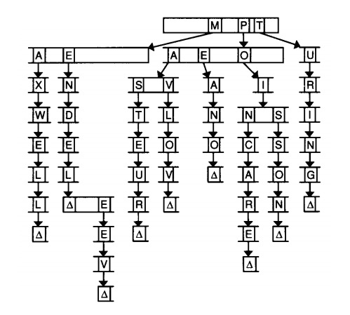

# Wednesday lecture

[Video](http://cs50.tv/2011/fall/lectures/7/week7w.mp4)

[Slides](http://cdn.cs50.net/2011/fall/lectures/7/week7w.pdf)

## Announcements and Demos (0:00–2:00)

* Thus far, we’ve worked almost exclusively with `C`, a very low-level pro-
  gramming language. In the weeks to come, we’ll dive in to `HTML` and
  `CSS`, which aren’t programming languages, per se, but rather mark-up
  languages. If we go to HarvardFML and right click to View Source, we
  can actually see all of the `HTML` and `CSS` that makes up this page.
  Languages like `PHP` and `SQL` will enable us to make these websites dynamic.

* Whereas we’ve had to work very hard to implement data structures like
  linked lists (and soon tries, trees, and hash tables) in `C`, we won’t have to
  do much at all, if anything, to implement these data structures in more
  high-level programming languages like `PHP`: some of these data structures
  are built-in and, in general, the syntax is much less complicated.

## From Last Time (5:00–18:00)

* We looked at stacks, which exhibit LIFO (last-in-first-out) storage. Imagine
  a stack of trays in Mather dining hall. The last tray added to the stack
  is on top and is the first to be taken. Stacks have the powerful advantage of
  allowing insertion and deletion in constant time.

* To implement a stack, we could consider using an array. As always, arrays
  come with the inconvenience of fixed size, but for this exercise, we can
  accept that. We can enclose this array within a struct in order to store
  other information relevant to the stack:

      typedef struct
      {
          int numbers[CAPACITY];
          int size;
      }
      stack;

  ``size represents the actual size of our stack—that is, the number of
  elements the stack currently contains—not to be confused with `CAPACITY`, which
  is the maximum number of elements the stack can contain.

* As part of our design, we’ll need to decide if we’re okay with our stack
  having a finite size or if we’ll need to implement a way for it to grow past
  `CAPACITY` using `malloc` to allocate more memory. The advantage of using
  an array here rather than a linked list is that arrays are built-in whereas
  linked lists require a lot of additional coding. This type of compromise is
  one you will find yourself making often in the world of programming: is
  it really worth it to write 400 lines of code just to slightly improve your
  program’s design? One of the challenges of the Final Project will be to
  rein in your ambitions and to be realistic about what you can accomplish
  in a few weeks’ time. The unfortunate truth is that many problems arise
  during the process that you couldn’t possibly have anticipated.

* Implementing a queue, which demonstrates FIFO (first-in-first-out) stor-
  age, would be very similar to implementing a stack:

      typedef struct
      { 
          int head;
          int numbers[CAPACITY];
          int size;
      }
      queue;
  
  The only difference between our implementations of queue and stack is
  this extra variable `head` within queue. When elements are plucked off
  a queue, the location of the head changes, so we need to keep track of
  this. This prevents us from having to shift all of the elements of the
  array to the left every time the first element is plucked off. In this case,
  we make a compromise of using an additional 4 bytes of space to avoid
  an expensive $$O(n)$$ operation. The tradeoff between time and space is
  a common theme in computer science. Recall that merge sort was the
  fastest sorting algorithm we looked at, but it was also the most expensive
  in terms of space because it required an additional array in which to place
  the sorted elements.

* For real-world applications, having a queue of finite size is fairly
* reasonable. Consider our Apple Store example, where a queue for new iPhones
  should be limited to 500 if there are only 500 iPhones in stock.

## Hash Tables (18:00–44:00)

* In an ideal world, we would be able to insert and access/remove elements
  in a data structure in constant time. The data structure that allows us to
  do this is called a hash table.

* Let’s assume we want a data structure that can store people’s names, e.g.
  Alice and Bob. We’ll begin with an array to store these names and we
  could, of course, insert names randomly into this array. However, the
  downside of this is that we don’t know where to find any of these names
  after we’ve inserted them, so we have to search the entire array to find a
  particular name. Once again, we’re back at $$O(n)$$ running time for search.

* A better solution would be to begin with an array of size 26 with one
  element for each letter of the alphabet. Then, we can place names in the
  array according to their first letter, e.g. Charlie in index 2. Now when we
  go to search for the name Charlie in our array, we can jump immediately
  to index 2. Woohoo, constant-time lookup!

* But, there’s a problem.[^1] What if there is more than one name that begins
  with a particular letter? We could consider using a two-dimensional array
  so that each element in the original array is another array. However, in
  doing so, we’d be blowing up our space requirements, which might not
  entirely be necessary given that the letters X, Y, and Z, for example, are
  unlikely to have more than one name.

[^1]: Sigh, isn’t there always?

* Given that X, Y, and Z are unlikely to have more than one name associated
  with them, perhaps we could use their indexes in the array to store the
  duplicate names that start with more common letters like C. First, we’ll
  try to insert Charlie into index 2, but if there’s already a name there,
  we’ll probe the array for the next empty element and place Charlie there.
  This makes more efficient use of our space, but ultimately, it leads to
  $$O(n)$$ lookup times: if Alice happens to be inserted at index `n−1` because
  all the other elements are full, then we’ll begin by looking at index 0 and
  iterate all the way to `n−1` before finding her.

* Maybe we’re making too big a deal of this idea of names that start with
  the same letter. What is the likelihood of it anyway? To answer this
  question, we’ll look at a related question:

  > In a room of n CS50 students, what’s the probability that at
  > least 2 have the same birthday?

  This question is easiest to answer by considering the opposite: what’s the
  probability that we all have different birthdays? This probability can
  represented as follows:

  <!--
  p(n) = 1 × 1 −
   ̄
  1
  365
  × 1−
  2
  365
  × ··· × 1 −
  n−1
  365
  -->

  !

  The probability that no 2 students have the same birthday is 1 when $$n$$ is
  1. The probability that no 2 students have the same birthday is $$1 * $$364 / 365$$
  when $$n$$ is 2 because there are $$364$$ possibilities for the second person’s
  birthday that don’t collide with the first person’s. The probability that
  no 3 students have the same birthday is $$1 × 364/365 × 363/365$$ . And so
  on. This series actually reaches high percentages fairly quickly. For
  example, when $$n$$ is 40, the probability of a collision is almost 90%.

* This same probability distribution can roughly be applied to the question
  of how likely it is that two names will begin with the same letter. Because
  the probability of collision quickly increases as the number of names
  increases, this isn’t a problem that we can sweep under the rug when
  designing our data structure.

* The act of walking through our hash table looking for an empty index is
  called linear probing. Let’s look at an alternative approach to handling
  collisions called separate chaining.

### Separate Chaining

* Clearly linear probing wasn’t a feasible solution to the problem of colli-
  sions given that it results in $$O(n)$$ lookups. Separate chaining is a better
  approach which implements each element of the hash table as a linked list.
  In separate chaining, collisions are handled by inserting the new value at
  the head of a linked list.

* Separate chaining solves at least one of the problems of linear probing,
  namely that the hash table is of finite size. If all of the indices in our hash
  table are filled and we’re using linear probing to handle collisions, then an
  entirely new hash table (i.e. array) needs to be allocated to handle the
  overflow. Not so with separate chaining since the linked lists in each index
  can grow dynamically as needed.

* The function that points us to a particular index in the hash table given
  a value to insert is called a hash function. Thus far, our hash function has
  been as simple as taking the first letter of the name we want to insert into
  the hash table and converting it to an integer. We might get more fancy
  with our hash function by taking the sum of the integer equivalents of the
  all of the letters in the name and taking the modulo of this sum to get a
  number between 0 and the size of our hash table.

* Searching for a value in a hash table that uses separate chaining is in
  $$O(n/k)$$ where $$k$$ is the size of the hash table and $$n$$ is the number
  of values it stores. If we assume that our hash function achieves perfectly
  uniform distribution, then we’ll end up with a linked list of length $$n/k$$
  at each index. If in the worst case, the value we’re searching for is at the
  end of one of these linked lists, then we’ll have to execute $$n/k$$ steps in
  order to find it.

* Theoretically, $$O(n/k)$$ is actually the same as $$O(n)$$ because in the
  worst case, every input into the hash table causes a collision and thus our
  hash table is just one linked list of length $$n$$. However, in practice,
  this isn’t the case, and our runtime will be faster.

* In order to store names in a hash table that uses separate chaining to
  handle collisions, we’ll need to implement linked lists whose nodes contain
  a string and a pointer. Such a node might look like so:

      typedef struct node
      {
          char word[LENGTH + 1];
          struct node *next;
      }
      node;

  `LENGTH` is a constant which we’ll use to represent the maximal length of a
  word that we want to store, plus one for the null terminator. Notice that
  we again have to write out struct node within this struct’s definition
  because the shorter alias node hasn’t been fully defined yet.

## Trees and Tries (44:00–59:00)

* Trees are data structures consisting of nodes, each of which may have
  any number of children. If each leaf has a maximum of two children, the
  tree is a binary tree. Children of the same parent are siblings. Terminal
  nodes -- those at the bottom that have no children -- are called leaves. See
  the diagram below.

  !
  
* A special kind of tree called a binary search tree allows us to use binary
  search to do lookups:

	!
  
  Binary search trees are specially structured so that each parent node is
  greater than its left child but less than its right child. If we were searching
  for the number 44 in the above tree, we would first check the root node,
  55. Because 44 is less than 55, we would go left. Because 44 is greater
  than 33 we would then go right and reach the desired result.

* Lookups in a binary search tree run in $$O(log n)$$. We can verify this using
  the diagram above: the height, or number of levels, is $$log n$$. Every time we
  go left or right in a binary search tree, we are cutting the size of the
  original problem in half, just as we did when tearing the phonebook in the
  first lecture.

* In a few weeks, we’ll begin looking at database engines like `MySQL`. In
  general, databases achieve high performance for reads and writes using tree
  structures (usually B-trees).

* Each node of a binary search tree might be implemented as follows:

      typedef struct node
      {
          int n;
          struct node *left;
          struct node *right;
      }
      node;

  Here, we have space in `n` for the actual value that the node stores as well
  as two pointers that point to the left and right child nodes. For any leaf
  in the tree, `left` and `right` will be `NULL`.

* Tries are another data structure which might prove useful to you as you
  complete Problem Set 6. A trie[^2] is a type of tree whose nodes are arrays
  of pointers to other nodes. Take a look at this visualization of a trie used
  to store names in which each array is of size 26 for the number of letters
  in the alphabet:

[^2]: The name supposedly comes from the word “retrieval” although it is typically pronounced

  
  
  We walk through a trie much the same way we walk through a hash table
  with separate chaining. Each letter in the word we’re inserting (converted
  to a number between 0 and 25) is also its index into the next level of the
  trie. So if we’re inserting the name Turing, we first hash to T, then to U,
  then to R, etc. What happens when we get to the end of a word? We
  need some sort of flag (represented as a triangle in the diagram above)
  the same as “try.” that marks the end of a word. That way, if two words share
  a prefix (e.g.  Max and Maxwell), we will know that both of them are in our
  trie if this end-of-word flag is set at both the X and the last L.

* What’s interesting about a trie is that it never actually stores any letters
  or words, but only pointers. The words are implicit.

* The compelling case for tries is that the running time of search is $$O(m)$$,
  where $$m$$ is the length of the longest word, and is thus independent of
  $$n$$, the number of words in the trie. Woohoo, constant-time lookup! Of
  course, we’re paying for this speedy lookup in memory: given that we
  have an array of 26 which is linked to 26 arrays of 26 which are linked
  to 26 arrays of 26, and so on, a trie is going to be quite large. We could
  save some space by using linked lists instead of arrays at each level, but
  in doing so, we’d give up random access which would again slow down our
  runtime.

* If we do use arrays to implement our trie, then a node might look like so:

      typedef struct node
      {
          bool is_word;
          struct node *children[27];
      }
      node;

  Why 27? We allow for alphabetical characters as well as apostrophes.
  `is_word` is the `end-of-word` flag we alluded to earlier.

## Compression (59:00–72:00)

### Morse Code

* You’ve probably heard of Morse code, a system used to transmit messages
  as a series of dots and dashes. One confusing aspect of Morse code is that
  there is ambiguity in some of the sequences. For example, a dot followed
  by a dash could either be the letter A or the letter E followed by the letter
  T. Some operators compensated for this by pausing between letters or by
  using context to figure out the more likely interpretation.

* Despite this ambiguity, Morse code is compelling in that it reduces more
  common letters like E to a single bit. Thus far, we’ve been using 8 bits to
  store every single character, but it’s clear that we could use fewer bits to
  store some characters in order to save space.

### Huffman Coding

* Consider the following arbitrary string as a candidate for compression:
  
  !

  Immediately, we can see that the string consists only of the letters A
  through E and that we can choose E as the character for which we allocate the
  fewest bits since it occurs with the highest frequency.

* To begin the process of compressing this string, we’ll create five trees, one
  for each letter that appears in the string:

  !
  
  Now let’s begin combining these trees into a larger tree, beginning with
  the two nodes that have the smallest frequencies:

  !
  
  We’ll also start labeling the edges between nodes, arbitrarily but
  consistently, with the digits 0 and 1. Continuing in this manner, connecting
  the two nodes with the smallest frequencies to a parent node that contains
  the sum of those frequencies, we get the following picture:

  !
  
  This type of tree is called a Huffman tree. Using this tree, we can represent
  the letters A through E as follows:
  
      A 01
      B 0000
      C 0001
      D 001
      E 1

  To get these bit representations, we simply follow the edges of the tree that
  get us to the leaf corresponding to each letter. To get to `A`, for example,
  we go left (`0`) and then right (`1`). To get to `B`, we go left (`0`) 4
  times. And so on.

* Notice two things: first, we’ve optimized for the most common letter, `E`,
  which requires the least number of bits; second, none of these bit
  representations is a prefix of the others. There is no confusion in
  interpreting the bit sequence `010000`, for example, because `01` can only be
  interpreted as an `A` and `0000` can only be interpreted as a `B`. Unlike
  Morse code, Huffman coding is unambiguous.

* For all of these letters, we succeeded in creating binary representations
  that required far fewer than 8 bits. Why use ASCII at all, then? Well,
  if our string contains more than just the letters `A` through `E`, we’re going
  to need more bits to represent it. The takeaway here is that if there are
  patterns in data, it can be compressed quite effectively.

* We can represent the nodes of a Huffman tree as follows:

      typedef struct node
      {
          char symbol;
          int frequency;
          struct node *left;
          struct node *right;
      }
      node;

* In the GIF file format, left-to-right lines are simplified as much as possible.
  The German flag, for example, consists of three horizontal bars, black, red,
  and yellow from top to bottom. Thus the top lines can be represented with
  a single black pixel that is repeated all the way across, the middle lines
  can be represented with a single red pixel that is repeated all the way
  across, and the bottom lines can be represented with a single yellow pixel
  that is repeated all the way across. The French flag, although it consists
  of three colored bars, as well, can’t be compressed as much as the German
  flag using the GIF format. This is because its bars are vertical rather
  than horizontal, so each line has to be represented as three pixels, one
  blue repeated a third of the way across, one white repeated a third of the
  way across, and one red repeated a third of the way across. You can see
  this in their file sizes: the French flag is 8 kilobytes in size whereas the
  German flag is 4 kilobytes in size.

* The same principle can be applied to movie compression: in each frame,
  you can throw away information that hasn’t changed since the last frame.

