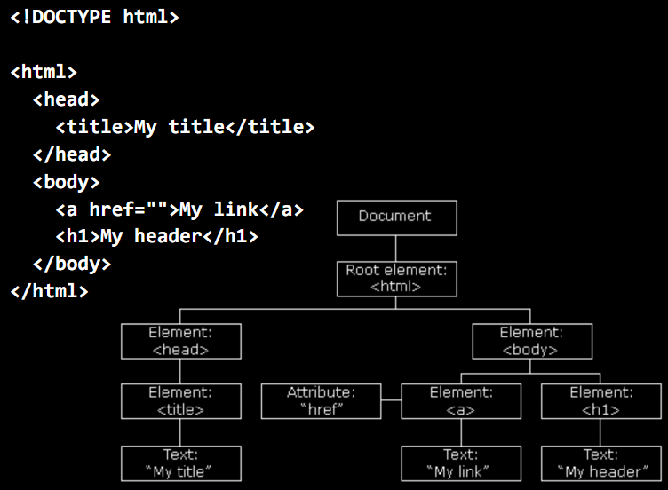

# Wednesday lecture

[Video](http://cs50.tv/2011/fall/lectures/8/week8w.mp4)

[Slides](http://cdn.cs50.net/2011/fall/lectures/8/week8w.pdf)

## Announcements and Demos (0:00–24:00)

* A number of APIs (Application Programming Interfaces) are
  [available](https://manual.cs50.net/Third-Party_APIs) for your use in the
  Final Project and beyond. These APIs are libraries of code that allow you to
  work with datasets like the Harvard course list or implement features like
  sending text messages or e-mails without having to reinvent the wheel.

* In Problem Set 5, we asked you to critique technologies you’ve seen in the
  real world. Some of your feedback is excerpted here:

  > – “All is good!”
  > – “With all due respect, the current system of study-cards could be
  > improved in my opinion. . . ”
  > – “The elevator in Mather house. Everyone always takes it from the rst
  > oor to the fourth, and it always stays there because almost nobody
  > takes it to go to the rst oor. Everyone always has to wait on the rst
  > oor for it to come down. It should be programmed to go to the rst
  > oor automatically after say, a minute or non-use.!”
  > – “Turning on the TV in the Canaday common room actually is quite
  > difcult. Not as easy as the click of a button. Why are there so many
  > buttons? It is so confusing. I wish there could be two remotes - one
  > with all the features and one with the basic functions like on and off,
  > volume and channel changing. Perhaps button size on the remote
  > could be different to denote importance. ‘Wait, do i need to access
  > the dvd player right now? no! I want to watch food network!’ I’d
  > love the on button to be big and ‘play’ dvd to be smaller, or more
  > logically organized.”
  > – “The CS50 appliance could use one feature/improvement. A bigger
  > screen. I have tried changing the screen size and resolution within the
  > appliance, and it is buggy and doesn’t scale up properly. . . Perhaps
  > there is a trick for changing the size without a buggy result, and I
  > don’t know about it. If so, I would love to know! I would love to have
  > a bigger screen! The speed is alright, but sometimes I wish I could
  > just use my Mac to code everything up, I do love my ‘textWrangler’
  > and ‘Xcode’, however an improved screen size would ease most of my
  > anxieties.”

  The fix for the screen resolution of the Appliance, by the way, is to
  [install guest
  additions](https://manual.cs50.net/Appliance#How_to_Install_Guest_Additions).

* If you’ve ever wondered how the internet really works, you should pay
  close attention to [this](http://www.youtube.com/watch?v=PBWhzz_Gn10) video
  from Warriors of the Net which explains it in detail. We talked briefly last
  week about TCP/IP, which mandates
  that every computer on the internet have an IP address so that it can be
  uniquely identified when sending packets. One thing we didn’t talk about
  is that TCP/IP guarantees delivery: if a packet is lost or otherwise fails
  to reach its destination, it will be resent. TCP/IP also allows servers to
  handle multiple services at once (e.g. mail, web, instant messaging) by
  including in each packet a port number in addition to a destination IP
  address. The default port numbers for web, e-mail, secure web, SSH, and
  FTP are 80, 25, 443, 22, and 21, respectively. These port numbers afford
  network administrators a very easy way to block certain traffic. Harvard,
  for example, seems to disallow traffic on the particular port number used
  for Wii network access.[^1] A few questions related to this video:

  > – Question: are packets really recycled? No. More properly, they’re
  > just created anew, the bits aren’t really reused.
  > – Question: what is a ping of death? A ping of death is a special type
  > of ECMP packet that has more bytes than it’s supposed to. In the
  > old days,[^2] a packet such as this was often enough to cause a web
  > server to crash.

  [^1]: Much to David’s dismay, since all he does is play Wii Tennis.
  [^2]: Like when David was in his twenties.

## More with HTML (24:00–58:00)

### From Last Time

* Last time, we began our foray into web development by creating a directory
  named `public_html` and making it executable by the world. We
  placed in this directory a file named `index.html` which contained some
  HTML that created a rather ugly web page. At the top of this file, there
  was a doctype declaration indicating that we’re using version 5 of HTML.
  Following that declaration, we had a series of tags, beginning with the
  html tag which enclosed everything. Some tags, such as body, can have
  attributes associated with them. We defined the background color of our
  web page using the `bgcolor` attribute of body.

* One tag we introduced was the `div` tag which allowed us to divide our
  page into separate buckets of content. We were able to specify the style
  attribute of each `div` in order to dictate how it would display upon
  rendering. For example, we used color: red to make the text color of this
  `div` red. This name-value pair was actually an example of a CSS (Cascad-
  ing Style Sheets) property. In the early days of the web, the only way to
  style a web page was with attributes like bgcolor, which were often inter-
  preted differently by different browsers. CSS, a language used specifically
  for styling, helps standardize the aesthetics of web pages.

* Recall that ` ` was a so-called empty tag because it is opened and closed
  with a single tag. There’s no need to write `  `.

* If you want to validate your web page, that is, check that its HTML is
  correctly formatted, you can copy and paste your source code into
  `validator.w3.org`. You can also validate by URL or file upload.

* To include links on your web page, you can use the a tag like so:

      <!DOCTYPE html>
      <html>
          <head>
              <title>My title</title>
          </head>

          <body>
              <a href="">My link</a>
              <h1>My header</h1>
          </body>
      </html>

  The `href` attribute determines where the link points. Here we also
  demonstrate the use of the `h1` tag, which defines a standard heading style
  with large, bold font.

### DOM

* The nesting of HTML tags defines a hierarchy of elements. The head and
  body elements are children of the html elements because they are nested
  within it. The `a` and `h1` elements are children of the body element. In
  fact, “My header” is a child of the `h1` element, albeit a textual one. The
  hierarchy of HTML elements can be visually represented as a tree:

  !
  
  At the top of the tree is a Document node which encompasses everything. The
  root element of the tree is the html element. We’ve drawn the href attribute
  on the same line as the a element because it’s not really a child. Given this
  tree structure of HTML, more properly called the DOM (Document Object Model),
  the actual elements of a page are accessible using JavaScript, as we’ll see
  in the coming weeks. Consider the autocom- plete feature of Google Maps. Even
  though the page doesn’t refresh as we type, search suggestions are being made
  on the fly by communicating with Google’s servers. This is done using
  JavaScript and more specifically, a technology called Ajax.

### link and script Tags

* Before we move on, let’s introduce two more tags that will help us organize
  the source code of our web page:

      <!DOCTYPE html>

      <html>
          <head>
              <link rel="stylesheet" href="styles.css">
              
              <title>hello, world</title>
          </head>

          <body>
          </body>
      </html>

  The link tag is similar to `#include` from C in that it allows us to import
  a separate file, in this case a CSS file. Similarly, the script tag with a
  specified `src` attribute allows us to include a JavaScript file.

* If we right click to View Source on the course website, we see among a lot
  of mess the following tag:

      <link href="/css/styles.css" rel="stylesheet" type="text/css" />

  This tells us that some of the CSS for the course website is defined in a
  file named styles.css within the subdirectory css. We can view this file
  by navigating to `http://cs50.net/css/styles.css`. As an example of
  what’s defined therein, take a look at these lines:

      /* should probably be renamed div#ohs */
      div#fyi
      {
          font-size: 77%;
      }
      div#fyi a
      {
          color: #0073AC;
          text-decoration: none;
      }
      div#fyi a:hover
      {
          text-decoration: underline;
      }

  These lines define rules for a div tag with the id attribute set to fyi,
  namely the section at the top of the course homepage which contains
  announcements. Once we had given some thought to what the default
  font size for the course website should be, we could define all the other
  font sizes relative to this. Thus, the font size of the fyi section is 77%
  of the default. The second set of curly braces above defines styles for
  any a tags that are within the div tag with id of fyi. We decided we
  wanted those to have a color of light blue (`#0073AC`) and not be underlined
  (`text-decoration: none`).

* Know that the ability to view the underlying CSS and JavaScript of a
  website is not limited to the course website. You can go to Facebook, for
  example, and peek at their CSS and JavaScript by following the URLs they
  include via the link and script tags. When you peek at their JavaScript,
  you’ll notice that it’s wholly unreadable. This is because they wrote it in a
  readable way and then obfuscated or minified it. Obfuscating or minifying
  JavaScript is a way of condensing it into fewer characters (e.g. by removing
  whitespace) to save bandwidth and making it harder to reverse engineer
  to protect intellectual property.

### Implementing Google

* When we type in “Harvard” into Google, we are redirected to a very long
  URL that displays our results. If we take that long URL and throw away
  a lot of the information that isn’t relevant to us, but only to the server,
  we get something like the following:

      http://www.google.com/search?query=harvard

  If you navigate directly to this URL, you will see the results for a search
  of “Harvard” even without all the other information in the URL. As you
  might have guessed, the string q=harvard in the URL designates our query
  as an input to some program on Google’s server[^3] that fetches results.
  Multiple key-value pairs can be specified in a URL so long as they are
  separated by ampersands (`&`).

* If we right click to View Source on Google’s homepage, we see a whole
  lot of HTML, most of which isn’t important to our discussion here. One
  interesting thing to note is the scalability concerns of all this HTML. If
  a programmer types an extra space by accident and that single space
  is downloaded a billion times over the course of user visits to Google
  in a single, that’s a billion unnecessary bytes that Google’s servers have
  transmitted.[^4] An errant space could mean a lot of money lost!

  [^3]: Yes, we only have one.
  [^4]: One time, I introduced a slash into our source code and broke Google.

* To clean up the mess of Google’s HTML, we can use a tool called Firebug
  that is installed by default in Firefox on the Appliance. When we right
  click on the search query box on Google’s homepage and select Inspect
  Element, we are presented with a window that displays the HTML in a
  much more readable format, as a hierarchical tree consisting of collapsi-
  ble elements. One of these elements is a form tag which has an action
  attribute specifying where data is to be sent when the form is submitted.
  In this case, it has the value `/search`.

* The form element has multiple children, some of which are input elements.
  One of these input elements has an attribute type specified as submit.
  This particular input element implements the Submit button familiar to
  you from so many websites. Interestingly, Firebug allows us to muck with
  the HTML of a website, so we can click on the value attribute of the
  “I’m Feeling Lucky” button and change it so that it instead displays “I’m
  Feeling Unlucky.”

* Now that we know that the magic of Google is really in the form element,
  we can implement our own version of Google like so:

      <!DOCTYPE html>

      <html>
          <head>
              <title>CS50 Search</title>
          </head>

          <body>
              

                  
                   
                  <form action="http://www.google.com/search">
                      <input name="q" type="text">
                       
                      <input type="submit" value="CS50 Search">
                      <input type="submit" value="I’m Feeling Lucky">
                  </form>
              

          </body>
      </html>

  Using Google Logo Generator, we can create our own Google-esque logo.
  Don’t forget to `chmod` it properly! Also note that our action attribute of
  the form needs to be a full URL pointing to Google, not simply `/search`.
  That’s because the search program doesn’t live on our server, but rather
  on Google’s.

## PHP (58:00–75:00)

### `froshims1.php`

* `froshims1.php` mimics a site that David made years ago to help automate
  the process of registering for freshman intramural sports. There are form
  inputs for name, gender, captainship, and dorm. To lay out the form, we
  use an HTML table:

      <?
      /****************************************
      * froshims1.php
      *
      * Computer Science 50
      * David J. Malan
      *
      * Implements a registration form for Frosh IMs.
      * Submits to register1.php.
      *****************************************/
      ?>

      <!DOCTYPE html>

      <html>
          <head>
              <title>Frosh IMs</title>
          </head>

          <body>
              

                  <h1>Register for Frosh IMs</h1>

                    

                  <form action="register1.php" method="post">
                      <table style="border: 0; margin-left: auto; margin-right: auto; text-align: left">
                      <tr>
                          <td>Name:</td>
                          <td><input name="name" type="text"></td>
                      </tr>

                      <tr>
                          <td>Captain:</td>
                          <td><input name="captain" type="checkbox"></td>
                      </tr>

                      <tr>
                          <td>Gender:</td>
                          <td>
                              <input name="gender" type="radio" value="F"> F
                              <input name="gender" type="radio" value="M"> M
                          </td>
                      </tr>

                      <tr>
                          <td>Dorm:</td>
                          <td>
                              <select name="dorm">
                                  <option value=""></option>
                                  <option value="Apley Court">Apley Court</option>
                                  <option value="Canaday">Canaday</option>
                                  <option value="Grays">Grays</option>
                                  <option value="Greenough">Greenough</option>
                                  <option value="Hollis">Hollis</option>
                                  <option value="Holworthy">Holworthy</option>
                                  <option value="Hurlbut">Hurlbut</option>
                                  <option value="Lionel">Lionel</option>
                                  <option value="Matthews">Matthews</option>
                                  <option value="Mower">Mower</option>
                                  <option value="Pennypacker">Pennypacker</option>
                                  <option value="Stoughton">Stoughton</option>
                                  <option value="Straus">Straus</option>
                                  <option value="Thayer">Thayer</option>
                                  <option value="Weld">Weld</option>
                                  <option value="Wigglesworth">Wigglesworth</option>
                              </select>
                          </td>
                      </tr>

                      </table>
                        
                      <input type="submit" value="Register!">
                  </form>
              

          </body>
      </html>

  The table tag introduces a spreadsheet-type layout. If we wanted to
  make this table actually visible, we can set its border CSS property to
  a non-zero value. As it is, we’re just using it to make sure things align
  properly.

* HTML forms can be submitted by one of two methods: GET and POST.
  Whereas GET transmits parameters via an addendum to the URL, POST
  transmits parameters via the HTTP headers. GET is slightly less secure
  because it is more readably visible, but it is also more convenient for
  creating persistent links for bookmarks. POST, of course, supports trans-
  mitting larger amounts of data (e.g. an image file) because URLs have a
  maximum length.

* We’ve implemented a radio button for the gender input by specifying
  type="radio". We can then have multiple options for this input and
  they will be mutually exclusive (i.e. selecting one will deselect the others)
  so long as all of the input tags have the same name attribute.

* The select tag implements a dropdown menu. We can specify how many
  elements in the menu we want to show at a given time using the size
  attribute. Each option tag that falls inside of the select tag represents
  a choice in the dropdown menu. What is actually transmitted by the form
  is stored in the value attribute for each of these option tags.

* Although our page is a PHP file (hence the `.php` extension), what it
  outputs to the browser is nothing but HTML. Herein lies the power of
  PHP: it can be commingled with HTML seamlessly. Our approach to
  outputting the names of freshman dorms is quite inefficient as it is. What
  would be better is storing the list of dorms in a database and then querying
  for it at the time a user visits the page. We’ll soon do this using PHP.

### `register1.php`

* What happens to our form data once it’s submitted? In the action at-
  tribute of our form tag, we specified register1.php. Let’s take a look at
  its source code:

      <?
      /****************************************
       * register1.php
       *
       * Computer Science 50
       * David J. Malan
       *
       * Implements a registration form for Frosh IMs. Redirects
       * user to froshims1.php upon error.
       *****************************************/

      // validate submission
      if (empty($_POST["name"]) || empty($_POST["gender"])|| empty($_POST["dorm"]))
      {
          header("Location: http://localhost/~jharvard/froshims/froshims1.php");
          exit;
      }
      ?>

      <!DOCTYPE html>

      <html>
          <head>
              <title>Frosh IMs</title>
          </head>

          <body>
              You are registered! (Well, not really.)
          </body>
      </html>

  PHP code is enclosed by `<?` and `?>`. When a web server is configured to
  recognize `.php` files, it will look for this source code on the server and
  then execute everything that’s between these two tags.

* If we try to submit our form data without filling in all the inputs, we
  get bounced back to the first page. This is accomplished with the if
  condition at the top of `register1.php`. Because we’ve submitted form
  data using the POST method, all of that data is handed to us in a so-called
  superglobal variable named `$_POST`. This variable is actually a hash table
  or an associative array. In C, our arrays could only have numerical indices,
  but in PHP, we can have strings and many other types as indices as well. In
  this if condition, we’re checking if any of the indices in `$_POST` have
  empty values associated with them. This would imply that the the user failed
  to fill in one of the inputs. If that’s true, then we redirect him or her to
  `froshims1.php` using the header function which spits out HTTP headers.

* The HTTP header of importance in this case is the Location header, which
  is generally used for redirecting. We can see this header in action if we open
  Live HTTP Headers while visiting `google.com` (not `www.google.com`).
  Upon doing so, we see that an HTTP response with code 301 Moved
  Permanently is returned by the server. Then a second HTTP request
  is issued for `www.google.com`. Why? Perhaps for branding or technical
  purposes, it’s not completely clear.

### `register3.php`

* As a teaser for next time, work your way through register3.php which
  sends an e-mail with your registration information using only a few lines
  of code:

      <?
      /*****************************************
       * register3.php
       *
       * Computer Science 50
       * David J. Malan
       *
       * Implements a registration form for Frosh IMs. Reports registration
       * via email. Redirects user to froshims3.php upon error.
       *****************************************/

      // validate submission
      if (!empty($_POST["name"]) && !empty($_POST["gender"]) && !empty($_POST["dorm"]))
      {
          $to = "malan@cs50.net";
          $subject = "Registration";
          $body = "This person just registered:\n\n" .
                  $_POST["name"] . "\n" .
                  $_POST["captain"] . "\n" .
                  $_POST["gender"] . "\n" .
                  $_POST["dorm"];
          $headers = "From: malan@cs50.net\r\n";

          mail($to, $subject, $body, $headers);
      }
      else
      {
          header("Location: http://localhost/~jharvard/froshims/froshims3.php");
          exit;
      }
      ?>

      <!DOCTYPE html>

      <html>
          <head>
              <title>Frosh IMs</title>
          </head>

          <body>
              You are registered! (Really.)
          </body>
      </html>

