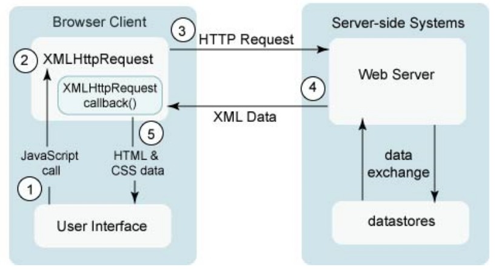

# Wednesday lecture

[Video](http://cs50.tv/2011/fall/lectures/10/week10w.mp4)

[Slides](http://cdn.cs50.net/2011/fall/lectures/10/week10w.pdf)

## Announcements and Demos (0:00–7:00)

* Apply now to be a TF or CA for next year’s course! We’ll try to hold
  interviews in January and finalize the staff by Spring Break.

* Hopefully you enjoyed Monday when we were joined in lecture by Jocelyn
  Goldfein and on campus by Mark Zuckerberg! Consider this: Mark
  released Facebook in February, 2004. By the end of 2004, it had 1 million
  users and by the end of 2005, it had 5.5 million users. Mark never actually
  took CS50, but spoke at one of its lectures in 2005. In it, he highlighted
  the importance of having a foundation in a language like C which enabled he
  and his roommates to pick up other languages like PHP very quickly.

## JavaScript (7:00–60:00)

* JavaScript is an entirely client-side programming language. When Facebook was
  first released, it didn’t have many of the features it has today
  (e.g. chat, realtime updates), most of which are based in JavaScript.

### Resurrecting the blink Tag

* Much to our chagrin, the `blink` tag was retired from HTML. Thankfully,
  it can be resurrected sing JavaScript:

      <!--
      blink.html
      Resurrects the blink tag.
      Computer Science 50
      David J. Malan
      -->

      <!DOCTYPE html>

      <html>
          <head>
              

              <title>blink</title>
          </head>

          <body>
              

                  <blink><h1>hello, world</h1></blink>
              

          </body>
      </html>

  Although we’re using the blink tag here, most browsers won’t actually
  recognize it and support its previous functionality. So we take care of it
  ourselves using a function named `blinker`.

* As a sidenote, realize that you don’t need the Appliance in order to program,
  especially after you exit this course. It is, however, useful to be able
  to run a different operating system within you computer’s native operating
  system. Still, you might opt for a much more lightweight solution of
  programming from `vi` or `emacs` or `nano` within a terminal window such as
  Terminal on a Mac or PuTTY on a Windows PC.

* To program from a terminal window on your own computer, you can
  `ssh` into `jharvard@192.168.56.50` which is the default address of the
  Appliance. This is representative of how you can get started with a project
  after this course: instead of the Appliance, you might ssh into a server
  hosted by a third-party company with MySQL, PHP, and more installed.
  Once we’ve done so, we can open `blink.html` using Nano or Vim, two
  free text editors.

* Inside `blinker`, we call a method named `getElementsByTagName`. As
  its name implies, this will retrieve all the tags within our HTML source
  whose name matches the argument we pass, in this case “blink.” Once we
  have all the blink tags, we loop through them and toggle the visibility
  attribute of their style between “hidden” and “visible.” This attribute
  is actually a CSS rule, which can also be altered with JavaScript.

* After defining the blinker function, we use a method named `setInterval`
  of the window object to dictate that it will be called every 500 milliseconds.
  Notice that the first argument we pass to `setInterval` is blinker, not
  `blinker()`. The latter would cause the blinker function to actually be
  called when it was passed as an argument. The former acts as a pointer
  to the function. Once we’ve registered blinker to be called every 500
  milliseconds, the CSS of the blink tag will be toggled regularly.

* Question: what if you specified the visibility attribute of the blink tag
  in a separate CSS file? The JavaScript would override that specification.

* The connection here to technologies that Facebook uses is that status updates
  and new chat messages can be pulled from the server regularly using
  JavaScript. Facebook most likely doesn’t use the setInterval function, since
  it would hammer their servers with hundreds of millions of request.  Rather,
  they use a technique called long polling which opens connections to the
  server that last for 30 seconds or more. Likewise does Google use this
  technique in order to look for new messages in your inbox.

### Ajax

* The technology that Google and Facebook use to poll their servers for
  updates is called Ajax, visualized in the diagram below:

  !

  In step 1, the Google and Facebook user interfaces make a JavaScript call.
  In step 2, a special JavaScript object called an `XMLHttpRequest` object is
  created which, in step 3, makes an HTTP request to the web server. This
  diagram indicates that, in step 4, XML data is returned by the server.
  However, these days, this data can also be in JSON (JavaScript object
  notation) format. XML is a data format that is something like “make
  your own HTML.” Instead of using predetermined tag names, you can
  create your own like so:

      <class>
          <students>
              <student id="123">
                  <name>David</name>
              </student>
          </students>
      </class>

  XML is handy in that you can codify both data and metadata. The data
  here is the ID number 123 and the name David. The metadata is the tag
  names: `class`, `students`, `name`, etc.

* Although it is useful in certain circumstances, XML is not always good in
  the context of Ajax because it requires a large number of bytes to represent
  very little information. JSON, on the other hand, is quite compact. We
  can represent the same data from the above XML using JSON like so:

      [
          {
              name: "David",
              id: 123
          }
      ]

  We can also easily add more student data like so:

      [
          {
              name: "David",
              id: 123
          },
          {
              name: "Matt",
              id: 456
          }
      ]

  JSON format is generally much more convenient than XML not only because it is
  more compact, but it is easier to generate. There exist built-in functions in
  PHP (e.g. `json_encode`) and many other languages, for example, that can
  convert arrays and objects to JSON.

#### `ajax1.html`

* Take a look at `ajax1.html`, our first foray into Ajax:

      <!--
      ajax1.html
      Gets stock quote from quote1.php via Ajax, displaying result with alert().
      Computer Science 50
      David J. Malan
      -->

      <!DOCTYPE html>

      <html>
          <head>
              

              <title>ajax1</title>
          </head>

          <body>
              <form onsubmit="quote(); return false;">
                  Symbol: <input id="symbol" type="text">

                    

                  <input type="submit" value="Get Quote">
              </form>
          </body>
      </html>

  From reading the comments, we know that this file will get a stock quote
  from a file called `quote1.php` via Ajax. In the HTML, we see that there is
  a form whose `onsubmit` attribute calls a JavaScript function named `quote`
  and then returns false no matter what. Why might we want to do that?
  Since we’re retrieving data via Ajax, we don’t actually need to `submit` the
  form anymore. We’re using the submit button just to know when the user
  has finished inputting information. Indeed, when we visit `ajax1.html` in
  our browser, type `GOOG` into the form field, and click Get Quote, we see
  a JavaScript alert window that displays “605.93,” the current stock price
  of Google, even though the form hasn’t actually been submitted and the
  URL has not changed.

* We can visualize the data retrieved from the server using Firebug’s Net
  tab. When we click Submit, we see that a GET request was made to
  `quote1.php?symbol=GOOG`. We know again that this request was asynchronous
  (the first “A” in Ajax) because the URL in the browser address bar didn’t
  change.

* How do we make this Ajax request? First, we initialize a global variable
  named `xhr` by trying to create a new `XMLHttpRequest` object. Unfortunately,
  this won’t work in Internet Explorer because Microsoft decided that their
  particular flavor of this object would be called an `ActiveXObject`. For that
  reason, we use the try-catch syntax, which attempts to execute the `try` block
  and only executes the `catch` block if the try block fails for some reason.

* After we’ve initialized `xhr`, we check for `null` just in case the user is
  running a browser that doesn’t support Ajax. Next we’re dynamically creating
  a URL which we’re going to request from the server. In a GET variable named
  `symbol`, we’re appending the value the user has entered into the text box.
  We are accessing this value by invoking a method called `getElementById`,
  which, as you might’ve guessed, searches for an HTML element whose `id`
  attribute we specify. In this case, we’ve given the text box an `id` of
  `symbol`, so that’s what we’re searching for.

* The three lines at the bottom of `quote` are the ones which actually retrieve
  the stock quote. First, via the onreadystatechange attribute, we’re
  telling xhr that once its done making its request, call a function named
  `handler` that we will write ourselves. The last two lines actually open a
  connection to the server and send the data. If you wanted to use the POST
  method, you would specify POST as the first argument to open and you would
  pass the actual data as the argument to send, rather than null. Passing true
  as the last argument to open indicates that we want the request to be
  asynchronous. We’ll wave our hands for now at this last argument.

* Within the handler function, we are checking two properties of the `xhr`
  object: `readyState` and `status`. First, we check `readyState` to find if
  the request has been sent successfully and second, we check `status`, to
  see if the server has returned a response of OK. If both of those checks
  are passed, then we access the `responseText` of the object and display it
  via an alert window.

#### `quote1.php`

* So let’s actually see what this URL will return if we access it directly.
  If we navigate to `quote1.php?symbol=GOOG`, we get back nothing but a
  stock quote -- no HTML markup, even. It is our `handler` function which
  will be manipulating this directly.

* Looking at the source code of `quote1.php`, we can see that it’s fairly
  simple and borrowed almost entirely from Problem Set 7:

      <?
      /**
       * quote1.php
       *
       * Outputs price of given symbol as text/html.
       *
       * Computer Science 50
       * David J. Malan
       */
      // get quote
      $handle = @fopen("http://download.finance.yahoo.com/d/quotes.csv?" .  
                       "s={$_GET["symbol"]}&f=e1l1", "r");
      if ($handle !== FALSE)
      {
          $data = fgetcsv($handle);

          if ($data !== FALSE && $data[0] == "N/A")
              print($data[1]);

          fclose($handle);
      }
      ?>

  From this code, we can tell that the script does nothing but access a Yahoo
  Finance URL and print out the response. This is why we don’t have any
  HTML markup, since nothing but the actual text of the stock quote is
  being printed.

#### `ajax2.html`

* Slightly more sophisticated than an alert window would be to embed the
  response in the actual HTML of the webpage. Check out `ajax2.html`:

      <!--
      ajax2.html
      Gets stock quote from quote1.php via Ajax, embedding result in page itself.
      Computer Science 50
      David J. Malan
      -->

      <!DOCTYPE html>

      <html>
          <head>
              

              <title>ajax2</title>
          </head>

          <body>
              <form onsubmit="quote(); return false;">
                  Symbol: <input id="symbol" type="text">
                   
                  Price: <b>to be determined</b>

                    

                  <input type="submit" value="Get Quote">
              </form>
          </body>
      </html>

  Where the stock price will go, we have an element of type `span`. This
  is similar to a `div` in that we can put almost anything inside it, but a
  `div`, being a block-level element, takes up the whole width of the window
  whereas a `span`, being an inline element, does not.

* In this version, when we click Get Quote, the text “to be determined”
  gets replaced by the actual stock quote. Interestingly, even after the stock
  quote is displaced, if we view the web page’s source, we see that the span
  still contains the text “to be determined.” JavaScript can change what’s
  displayed by the browser, but it doesn’t change what was originally sent
  by the server. We can use Firebug, however, to see changes to the DOM.

* The only difference between the JavaScript in `ajax2.html` and that in
  `ajax1.html` is the handler function. Now when the Ajax request returns
  successfully, we’re changing the innerHTML property of the price element
  rather than popping up an alert window. innerHTML initially holds the
  text “to be determined” (within a b tag) which we will clobber with the
  stock price we just looked up.

#### `ajax3.html`

* In `ajax3.html`, we make our presentation of stock data ever so slightly
  sexier:

        <!--

        ajax3.html

        Gets stock quote (plus day's low and high) from quote2.php via Ajax,
        embedding result in page itself after indicating progress with an
        animated GIF.

        Computer Science 50
        David J. Malan

        -->

        <!DOCTYPE html>

        <html>
          <head>
            
            <title>ajax3</title>
          </head>
          <body>
            <form onsubmit="quote(); return false;">
              Symbol: <input id="symbol" type="text">
                
              

                
                  
              

              

                
              <input type="submit" value="Get Quote">
            </form>
          </body>
        </html>

* In this version, when we click Get Quote, a fake progress bar is displayed
  (the animation is built into the GIF and doesn’t actually indicate how
  close the request is to completion) for a few seconds before the stock data
  appears.

* In the actual HTML source, we see that the progress bar GIF is actually
  already embedded. But because the div which contains it has its CSS
  property display set to none, it won’t actually be visible when the page is
  first loaded. If we examine the JavaScript, we see that it’s almost identical
  to `ajax2.html`, except for two lines, one in the quote function which sets
  the display property to block, and one in the handler function which
  sets this display property back to none. This is how we show and hide
  the GIF when the user clicks Get Quote and when the stock data returns
  from the server, respectively.

#### `quote2.php`

* We’re also displaying more than just the stock price at this point. Let’s
  take a look at how we do that in `quote2.php`:

        <?

            /**
             * quote2.php
             *
             * Outputs price, low, and high of given symbol as text/html, after
             * inserting an artificial delay.
             *
             * Computer Science 50
             * David J. Malan
             */

            // pretend server is slow
            sleep(5);

            // try to get quote
            $handle = @fopen("http://download.finance.yahoo.com/d/quotes.csv?s={$_GET["symbol"]}&f=e1l1hg", "r");
            if ($handle !== FALSE)
            {
                $data = fgetcsv($handle);
                if ($data !== FALSE && $data[0] == "N/A")
                {
                    print("Price: {$data[1]}");
                    print(" ");
                    print("High: {$data[2]}");
                    print(" ");
                    print("Low: {$data[3]}");
                }
                fclose($handle);
            }
        ?>

  You can see that instead of simply returning a single number, `quote2.php`
  is actually spitting out some HTML. This HTML is what we will dynamically
  insert into `ajax3.html` when the Ajax call returns successfully. Notice also
  that we were faking some of the server slowness by calling sleep to cause the
  script to wait for 5 seconds so that our progress bar would have some time to
  display.

* Incidentally, the curly braces surrounding `$data` tell PHP that it is a
  variable that should be replaced with its value.

#### `ajax4.html`

* Having a function named handler in our previous examples feels a little
  sloppy because we’re only using this function once. As an alternative, we
  might define it as an anonymous function and assign it directly as the
  state change event handler for our Ajax request, as we do in `ajax4.html`:

        <!--

        ajax4.html

        Gets stock quote from quote1.php via Ajax, displaying result with alert().
        Implements handler as an anonymous function.

        Computer Science 50
        David J. Malan

        -->

        <!DOCTYPE html>

        <html>
          <head>
            
            <title>ajax4</title>
          </head>
          <body>
            <form onsubmit="quote(); return false;">
              Symbol: <input id="symbol" type="text">
                
              <input type="submit" value="Get Quote">
            </form>
          </body>
        </html>

  This way of structuring our code certainly has its appeal as its more
  compact and yet still readable. The code within the function is actually
  identical to what it was in handler in `ajax1.html`.

#### `quote3.php`

* In `quote3.php`, we create an associative array with values corresponding
  to the price, the high, and the low for a given stock symbol:

        <?

            /**
             * quote3.php
             *
             * Outputs price, low, and high of given symbol as JSON.
             *
             * Computer Science 50
             * David J. Malan
             */

            // try to get quote
            $quote = array();
            $handle = @fopen("http://download.finance.yahoo.com/d/quotes.csv?s={$_GET["symbol"]}&f=e1l1hg", "r");
            if ($handle !== FALSE)
            {
                $data = fgetcsv($handle);
                if ($data !== FALSE && $data[0] == "N/A")
                {
                    $quote["price"] = $data[1];
                    $quote["high"] = $data[2];
                    $quote["low"] = $data[3];
                }
                fclose($handle);
            }
            header("Content-type: application/json");
            print(json_encode($quote));

        ?>

  Once we do a quick sanity check on the return values from Yahoo’s server,
  we create an associative array with keys of price, high, and low. Passing
  this array to the `json_encode` function will create a JavaScript object
  with properties of the same names. The syntax for this object might look
  something like the following:

      {"price":"26.50","high":"26.75","low":"26.44"}

  To make it a little more readable, we can clean it up as follows:

      {
          "price": 26.50,
          "high": 26.75,
          "low": 26.44
      }

#### `ajax5.html`

* In `ajax5.html`, we make use of the JSON-encoded response returned by
  the server:

        <!--

        ajax5.html

        Gets stock quote (plus day's low and high) from quote3.php via Ajax,
        embedding (JSON) result in page itself.

        Computer Science 50
        David J. Malan

        -->

        <!DOCTYPE html>

        <html>
          <head>
            
            <title>ajax5</title>
          </head>
          <body>
            <form onsubmit="quote(); return false;">
              Symbol: <input id="symbol" type="text">
                
              Price: 
               
              High: 
               
              Low: 
               
                
              <input type="submit" value="Get Quote">
            </form>
          </body>
        </html>

#### `ajax6.html`

* ajax6.html uses the jQuery library we introduced on Monday to accomplish the
  same Ajax requests we’ve been making in the previous examples:

        <!--

        ajax6.html

        Gets stock quote (plus day's low and high) from quote3.php via Ajax
        using jQuery, embedding (JSON) result in page itself.

        Computer Science 50
        David J. Malan

        -->

        <!DOCTYPE html>

        <html>
          <head>
            
            
            <title>ajax6</title>
          </head>
          <body>
            <form id="form">
              Symbol: <input id="symbol" type="text">
                
              Price: 
               
              High: 
               
              Low: 
               
                
              <input type="submit" value="Get Quote">
            </form>
          </body>
        </html>

  One huge advantage of using the jQuery library is reducing the amount of
  code we have to write ourselves. Notice that we no longer have a need for
  try-catch syntax to handle different browsers or even a handler function
  to check for the correct response status and act accordingly. Instead, we
  have a single function call (with a few other function calls nested within).

* As on Monday, we’re calling the ready method of the `$(document)` object,
  jQuery’s version of the DOM that has some additional useful methods.
  The ready method is called automatically when the page has loaded. To
  this ready method, we pass an anonymous function in which we grab the
  HTML element with an `id` of `form` (using the `$` syntax again) and call its
  submit method. Incidentally, the `$` notation is some slickness on the part
  of jQuery’s developers. `$` in JavaScript is a valid character for function
  names, so `$` is actually the name of a function defined in the jQuery library.
  We pass to the submit method another anonymous function which will be
  called when the form is submitted. This innermost anonymous function
  is what actually makes the Ajax request and handles the response.

* jQuery has a special function called `ajax` which does the heavy lifting for
  making Ajax requests. To use it, we pass a JavaScript object which has
  certain attributes, including `url`, `data`, and `success` in this case.
  `url` is
  the URL which we’ll be requesting data from. `data` is an object which
  encompasses the parameters we want to send to this URL, in this case
  the stock symbol the user has provided in the HTML element whose `id`
  is `symbol`. `success` is a function (which takes a single argument) that
  will be called when the Ajax request returns successfully: this takes the
  place of handler that was previously assigned to the `onreadystatechange`
  attribute of the `XMLHttpRequest` object. The argument that is passed to
  the anonymous success function[^3] is assumed to be in JSON format, so
  jQuery automatically evaluates it and creates a corresponding JavaScript
  object. Thus, we can right away access its `price`, `high`, and `low` attributes
  just as we did in `ajax5.html`. In order to inject HTML into the span
  elements as before, we can simply call the html function defined by jQuery.

  [^3]: We’ve called it data, but we can actually call it anything we want.

