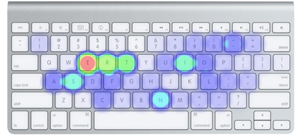

# Learning C.

This week you'll learn a lot of first things about programming, and in
particular, about the language called 'C'.

To get you in the mood, these are the keys you'll be using most frequently
when programming in C.

For this problem set, and most thereafter, you can choose between the Standard
edition and the Hacker edition. While we would advise most anyone to choose
the Standard edition, if you feel that you finish very quickly or you want a
bit of extra fun, definitely do the Hacker edition!
