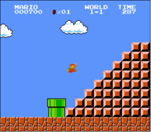

**Note: This is part of the 'Minor Programmeren' of semester 2, which starts at
Februari 3rd, 2014.**

# This is problem set 1

* Problem set 1 is called **C**.

* The deadline for this problem set is Friday **Februari 7th, 2014** (16:00).

# Commands

*(Skip to the __Getting Started__ section on your first read-through!)*

* Example implementations:

		~cs50/pset1/hello
		~cs50/pset1/mario
		~cs50/pset1/greedy

* `check50` commands:

		check50 2013.pset1.hello hello.c
		check50 2013.pset1.mario mario.c
		check50 2013.pset1.greedy greedy.c

# Getting started

* This text assumes you have the appliance up and running. If not, head back to
the "Setting up" page for instructions on how to do so.

* To ensure your appliance remains up to date, be sure to update your appliance
every now and then. To do so, open up your **Terminal** and type

		update50

which will then proceed to download any updates and install them.

* Know that, whenever your appliance has internet issues, you can type

		connect50

to have the appliance automatically fix these issues for you! You might need to
restart the appliance after you've ran `connect50` for the changes to take
effect.

* Now, let's start on the problem set. First, create a new directory for your
problem set's files to live in. Open up your **terminal** and type

		cd Desktop

which will move you from your current position to your Desktop. Once there,
you should see that your prompt has changed from
  
		jharvard@appliance (~):

to

		jharvard@appliance (~/Desktop):

* Next, create a new directory named `pset1` by executing

		mkdir pset1

* Now, you can move yourself to this newly created directory by executing

		cd pset1

which should change your prompt to

		jharvard@appliance (~/Desktop/pset1):

* Using the `touch` command, you can create a new file, not unlike how you've
just created a new directory. To create a file called `hello.c`, type

		touch hello.c

* To change the contents of this new and empty file, type

		gedit hello.c

to open the file in an editor that might be reminiscent of Window's Notepad.
This will be the program you'll be using to write your code during the course.
For now, just close the file again without writing anything to it.

* Up until now, we have just used only the **terminal** to navigate through the
appliance. You can also navigate through the appliance in the way you're
probably used to when using Windows or MAC OS (as per using your mouse to
navigate through a Guided User Interface), but it's best to get comfortable
with using the terminal as soon as possible. You'll definitely need it for
certain other tasks soon enough!

* [Watch this video.](http://www.youtube.com/watch?v=HkQD6aw7oDc)

* Navigate to your `pset1` folder using the **terminal** and then type

		gedit hello.c

to open up your `hello.c` file in a text editor.

* Go ahead and write your first program by typing these lines into the file:

		#include <stdio.h>
		
		int main(void)
		{
			printf("hello, world\n");
		}

* Notice how gedit adds syntax highlighting (color) as you type. Those colors
aren not actually saved inside of the file itself; they are just added by gedit
to make certain syntax stand out. Had you not saved the file as `hello.c` from
the start, gedit would not know (per the extension) that you are writing C code,
in which case those colors would be absent.

* Do be sure that you type in this program just right, else youre about to
experience your first bug! In particular, capitalization matters, so dont
accidentally capitalize words (unless theyre between those two quotes). And
dont overlook that one semicolon. C is quite nitpicky!

* When done typing, select **File > Save** (or hit ctrl-s), but dont quit.
Recall that the leading asterisk in the tabs name should then disappear.

* As you can see, gedit itself also has a **terminal** window, although it
initially rests in your home directory. Type

		cd Desktop/pset1

to immediately move yourself from your home directory to your `pset1`
directory. You can then use

		ls

to confirm that your `hello.c` file is indeed there. `ls` stands for "list",
and provides a listing of the contents of the current directory, whereas `cd`
stands for "change directory".

* Assuming `ls` indeed shows `hello.c`, you can type

		make hello

to compile your textual code into binary code that the computer can execute.
If you just receive the same prompt, you're succesful! You can then type

		./hello

to execute the binary code you just generated.

* If, though, upon running `make`, you instead see some error(s), its time to
debug! (If the terminal windows too small to see everything, click and drag
its top border upward to increase its height.) If you see an error like
expected declaration or something no less mysterious, odds are you made a
syntax error (a typo) by omitting some character or adding something in
the wrong place. Scour your code for any differences vis-a-vis the template
above. Its easy to miss the slightest of things when learning to program, so
do compare your code against ours character by character; odds are the
mistake(s) will jump out! Anytime you make changes to your own code, just
remember to re-save via **File > Save** (or ctrl-s), then re-click inside of the
terminal window, and then re-type

		make hello

at your prompt, followed by Enter. (Just be sure that you are inside of
`~/Desktop/pset1` within your terminal window, as your prompt will confirm or
deny.) If you see no more errors, try running your program by typing

		./hello

at your prompt! Hopefully you now see precisely the below?

		hello, world

# Using check50

Now lets see if the program you just wrote is correct! Included in the CS50
Appliance is `check50`, a command-line program with which you can check the
correctness of (some of) your programs.

To check your implementation of `hello.c` which you've just written, navigate
to your folder as per

	cd Desktop/pset1

and then execute

	check50 2013.pset1.hello hello.c

to perform `check50` over your program. If all commentary is green-colored,
your program is fully correct. If one or more yellow or red commentaries
appear, you've made a mistake. Best to retrace your steps, or ask an assistant
for help!

# Using style50

In addition to `check50`, the CS50 Appliance comes with `style50`, a tool with
which you can evaluate your codes style. To run it on, say, `hello.c`,
execute the below:

	style50 hello.c

You should see zero or more lines of suggestions. Yellow smilies indicate
warnings that you should consider addressing. Red smilies indicate errors that
you should definitely address.

Know that `style50` does not scour your code for all possible style flaws. For
example, it cannot understand the comments you type. In other words, having a
flawless output from `style50` does not in fact mean that your code style itself
is also flawless.

# Shorts

TBA

# `mario.c`

Toward the end of World 1-1 in Nintendos Super Mario Brothers, Mario must
ascend a "half-pyramid" of blocks before leaping (if he wants to maximize his
score) toward a flag pole. Below is a screenshot.

Write, in a file called mario.c in your `~/Desktop/pset1` directory, a program
that recreates this half-pyramid using hashes (#) for blocks. However, to make
things more interesting, first prompt the user for the half-pyramids height,
a non-negative integer no greater than 23. (The height of the half-pyramid
pictured above happens to be 8.) If the user fails to provide a non-negative
integer no greater than 23, you should re-prompt for the same again. Then,
generate (with the help of printf and one or more loops) the desired half-
pyramid. Take care to align the bottom-left corner of your half-pyramid with
the left-hand edge of your terminal window, as in the sample output below.

	jharvard@appliance (~/Desktop/pset1): ./mario
	Height: 8
	       ##
	      ###
	     ####
	    #####
	   ######
	  #######
	 ########
	#########

Note that the rightmost two columns of blocks must be of the same height. No
need to generate the pipe, clouds, numbers, text, or Mario himself.

By contrast, if the user fails to provide a non-negative integer no greater
than 23, your programs output should instead resemble the below (Recall that
`GetInt` will handle some, but not all, re-prompting for you.)

	jharvard@appliance (~/Dropbox/pset1): ./mario
	Height: -2
	Height: -1
	Height: foo
	Retry: bar
	Retry: 1
	##

Remember that you can use

	make mario

to compile your program and then

	./mario

to run it.

You can check the correctness of your program with

	check50 2013.pset1.mario mario.c

and/or run our own example implementation (for comparison) with:

	~cs50/pset1/mario

To get you on your way,
[watch this video](http://www.youtube.com/watch?v=z32BxNe2Sfc).

# `greedy.c`

Speaking of money, "counting out change is a blast (even though it boosts
mathematical skills) with this spring-loaded changer that you wear on your 
belt to dispense quarters, dimes, nickels, and pennies into your hand." Or so
says the website on which we found this here accessory (for ages 5 and up).

Of course, the novelty of this thing quickly wears off, especially when
someone pays for a newspaper with a big bill. Fortunately, computer science
has given cashiers everywhere ways to minimize numbers of coins due: greedy
algorithms.

According to the National Institute of Standards and Technology (NIST), a
greedy algorithm is one "that always takes the best immediate, or local,
solution while finding an answer. Greedy algorithms find the overall, or
globally, optimal solution for some optimization problems, but may find 
less-than-optimal solutions for some instances of other problems."

Whats all that mean? Well, suppose that a cashier owes a customer some change
and on that cashiers belt are levers that dispense quarters, dimes, nickels,
and pennies. Solving this "problem" requires one or more presses of one or
more levers. Think of a "greedy" cashier as one who wants to take, with each
press, the biggest bite out of this problem as possible. For instance, if some
customer is owed 41 cents, the biggest first (i.e., best immediate, or local)
bite that can be taken is 25 cents (in the case of dollars, that is). Note
that a bite of this size would whittle what was a 41 cent problem down to a 16
cent problem, since 41 - 25 = 16. That is, the remainder is a similar but
smaller problem. Needless to say, another 25 cent bite would be too big (assuming
the cashier prefers not to lose money), and so our greedy cashier would move
on to a bite of size 10 cents, leaving him or her with a 6 cent problem. At that point,
greed calls for one 5 cent bite followed by one 1 cent bite, at which point
the problem is solved. The customer receives one quarter, one dime, one
nickel, and one penny: four coins in total.

It turns out that this greedy approach (i.e., algorithm) is not only locally
optimal but also globally so for Americas currency (and also the European
Unions). That is, so long as a cashier has enough of each coin, this
largest-to-smallest approach will yield the fewest coins possible.

How few? Well, you tell us. Write, in a file called `greedy.c` in your
`~/Desktop/pset1` directory, a program that first asks the user how much
change is owed and then spits out the minimum number of coins with which said
change can be made. Use `GetFloat` from the CS50 Library to get the users
input and printf from the Standard I/O library to output your answer. Assume
that   the only coins available are quarters (0,25), dimes (0,10), nickels
(0,05), and pennies (0,01). **Do not write your program using European
currency!**

We ask that you use `GetFloat` so that you can handle dollars and cents,
albeit sans dollar sign. In other words, if some customer is owed $9,75 (as in
the case where a newspaper costs $0,25 but the customer pays with a $10 bill),
assume that your programs input will be 9.75 and not $9.75 or 975. However,
if some customer is owed $9 exactly, assume that your programs input will be
9.00 or just 9 but, again, not $9 or 900. Of course, by nature of floating-
point values, your program will likely work with inputs like 9.0 and 9.000 as
well; you need not worry about checking whether the users input is
"formatted" like money should be. And you need not try to check whether a
users input is too large to fit in a float. But you should check that the
users input makes cents! Er, sense. Using `GetFloat` alone will ensure that
the users input is indeed a floating-point (or integral) value but not that
it is non-negative. If the user fails to provide a non-negative value, your
program should re-prompt the user for a valid amount again and again until the
user complies.

Incidentally, do beware the inherent imprecision of floating-point values. For
instance, 0.01 cannot be represented exactly as a float. Try printing its
value to, say, 50 decimal places, with code like the below:

	float f = 0.01;
	printf("%.50f\n", f);

Before doing any math, then, youll probably want to convert the users input
entirely to cents (i.e., from a `float` to an `int`) to avoid tiny errors that
might otherwise add up! Of course, dont just cast the users input from a
`float` to an int! After all, how many cents does one dollar equal? And be
careful to round and not truncate your pennies!

[Watch this video](http://www.youtube.com/watch?v=9dZzyl7dCuw) to help you get
on your way.

Remember that you can use `check50` to check the correctness of your solution.
The `check50` command for this particular program is

	check50 2013.pset1.greedy greedy.c

To have your program pass the tests, it should only output one integer, which
is the amount of coins to return. In other words, do not seperately print the
amount of, say, pennies, in addition to this number. Your solutions should
always be compliant with `check50`; address any yellow and red warnings you
receive from `check50` if you can! And when in doubt, ask the assistants to
help you!

# Final steps

When you are done with `hello.c`, `mario.c`, and `greedy.c`, submit them by
going over to the **Submit** tab. Be sure to test them with `check50` and
`style50` one last time before you submit them!

All done!
