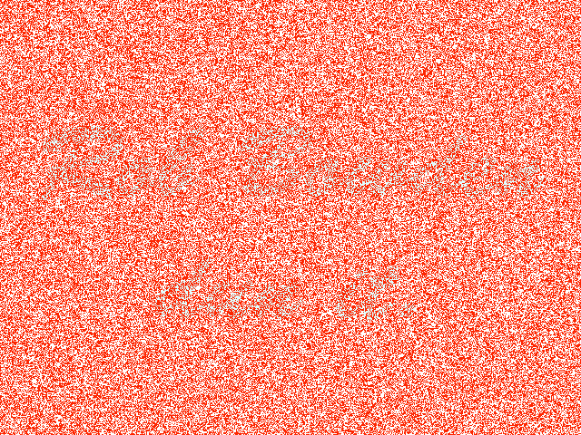
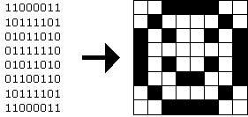
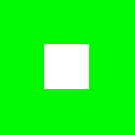
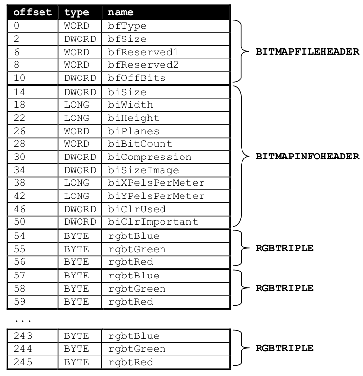

# Specification and source files

* [Specification](http://cdn.cs50.net/2011/fall/psets/5/hacker5.pdf)

* [git](http://cdn.cs50.net/2011/fall/psets/5/hacker5.git/)
* [Index](http://cdn.cs50.net/2011/fall/psets/5/hacker5/)
* [ZIP](http://cdn.cs50.net/2011/fall/psets/5/hacker5.zip)

# Problem Set 5: Forensics

## Goals.

* Better acquaint you with file I/O.

* Get you more comfortable with data structures, hexadecimal, and pointers.

* Introduce you to computer scientists across campus.

* Help Mr. Boddy.

## Recommended Reading.[^1]

* <http://www.cprogramming.com/tutorial/cfileio.html>

* Chapters 18, 24, 25, 27, and 28 of Absolute Beginner’s Guide to C

* Chapters 9, 11, 14, and 16 of Programming in C

* <http://en.wikipedia.org/wiki/BMP_file_format>

* <http://en.wikipedia.org/wiki/Hexadecimal>

* <http://en.wikipedia.org/wiki/Jpg>

## Differences with the normal edition

* Hacker Edition challenges you to reduce (and enlarge) BMPs.

[^1]: The Wikipedia articles are a bit dense; feel free to skim or skip!

## Getting Started.

* Welcome back!

* Go ahead and open up a terminal window (whether by opening gedit via
  Menu > Programming > gedit or by opening Terminal itself via Menu >
  Programming > Terminal). Then execute

      cd

  to ensure that you’re in your home directory, and then execute

      git clone http://cdn.cs50.net/2011/fall/psets/5/pset5.git/

  to download this problem set’s distro into your appliance. 

  Once successful, you should find that you have a brand-new `pset5` directory
  inside of your home directory. You can confirm as much with:

      ls

  Navigate your way to that directory by executing the command below.

      cd ~/pset5

  If you list the contents of your current working directory (remember how?),
  you should see the below. If you don’t, don’t hesitate to ask the staff for
  assistance!

      bmp/ jpg/ questions.txt

  As this output implies, most of your work for this problem set will be
  organized within two subdirectories. Let’s get started.

* If you ever saw Windows XP’s default wallpaper (think rolling hills and blue
  skies), then you’ve seen a BMP. If you’ve ever looked at a webpage, you’ve
  probably seen a GIF. If you’ve ever looked at a digital photo, you’ve probably
  seen a JPEG. If you’ve ever taken a screenshot on a Mac, you’ve probably seen
  a PNG. Read up a bit on the BMP, GIF, JPEG, and PNG file formats.[^3] Then, in
  `~/pset5/questions.txt`, answer the following questions.

  0. How many different colors does each format support?

  1. Which of these formats supports animation?

  2. What’s the difference between lossy and lossless compression?

  3. Which of these formats is lossy-compressed?

* Recall how Wi-Fi works? That's okay. History suggests I'll forget to ask
  about it anyway!

[^3]: For this question, you’re welcome to consult How Computers Work, Google, Wikipedia, a friend, or anyone else, so long as your words are ultimately your own!

* Curl up with the article from MIT below.

  > <http://cdn.cs50.net/2011/fall/psets/5/garfinkel.pdf>

  Though somewhat technical, you should find the article’s language quite
  accessible. Once you’ve read the article, answer each of the following
  questions in a sentence or more in `~/pset5/questions.txt`.

  4. What happens, technically speaking, when a file is deleted on a FAT file
  system?

  5. What can someone like you do to ensure (with high probability) that files
  you delete cannot be recovered?

## Whodunit.

* Welcome to Tudor Mansion. Your host, Mr. John Boddy, has met an untimely
  end—he’s the victim of foul play. To win this game, you must determine
  whodunit.

  Unfortunately for you (though even more unfortunately for Mr. Boddy), the only
  evidence you have is a 24-bit BMP file called `clue.bmp`, pictured below, that
  Mr. Boddy whipped up on his computer in his final moments.[^4] Hidden among this
  file’s red “noise” is a message from him to you.

  !

[^4]: Realize that this BMP is in color even though you might have printed this document in black and white.

  You long ago threw away that piece of red plastic from childhood that would
  solve this mystery for you, and so you must attack it as a computer scientist
  instead.

  But, first, some background.

* Perhaps the simplest way to represent an image is with a grid of pixels
  (i.e., dots), each of which can be of a different color. For black-and-white
  images, we thus need 1 bit per pixel, as 0 could represent black and 1 could
  represent white, as in the below.[^5]

  !

  In this sense, then, is an image just a bitmap (i.e., a map of bits). For more
  colorful images, you simply need more bits per pixel. A file format (like GIF)
  that supports “8-bit color” uses 8 bits per pixel. A file format (like BMP,
  JPEG, or PNG) that supports “24-bit color” uses 24 bits per pixel.[^6]

  A 24-bit BMP like Mr. Boddy’s uses 8 bits to signify the amount of red in a
  pixel’s color, 8 bits to signify the amount of green in a pixel’s color, and 8
  bits to signify the amount of blue in a pixel’s color. If you’ve ever heard of
  RGB color, well, there you have it: red, green, blue.

  If the R, G, and B values of some pixel in a BMP are, say, `0xff`, `0x00`, and
  `0x00` in hexadecimal, that pixel is purely red, as `0xff` (otherwise known as 255
  in decimal) implies “a lot of red,” while `0x00` and `0x00` imply “no green” and
  “no blue,” respectively. Given how red Mr. Boddy’s BMP is, it clearly has a
  lot of pixels with those RGB values. But it also has a few with other values.

  Incidentally, HTML and CSS (languages in which webpages can be written) model
  colors in this same way. If curious, see the URL below for more details.

  > <http://en.wikipedia.org/wiki/Web_colors>

  Now let’s get more technical. Recall that a file is just a sequence of bits,
  arranged in some fashion. A 24-bit BMP file, then, is essentially just a
  sequence of bits, (almost) every 24 of which happen to represent some pixel’s
  color. But a BMP file also contains some “metadata,” information like an
  image’s height and width. That metadata is stored at the beginning of the file
  in the form of two data structures generally referred to as “headers” (not to
  be confused with C’s header files).[^7] The first of these headers, called
  `BITMAPFILEHEADER`, is 14 bytes long. (Recall that 1 byte equals 8 bits.) The
  second of these headers, called `BITMAPINFOHEADER`, is 40 bytes long.
  Immediately following these headers is the actual bitmap: an array of bytes,
  triples of which represent a pixel’s color.8 However, BMP stores these
  triples backwards (i.e., as BGR), with 8 bits for blue, followed by 8 bits
  for green, followed by 8 bits for red.9 In other words, were we to convert
  the 1-bit smiley above to a 24-bit smiley, substituting red for black, a
  24-bit BMP would store this bitmap as follows, where 0000ff signifies red and
  ffffff signifies white; we’ve highlighted in red all instances of 0000ff.

      ffffff ffffff 0000ff 0000ff 0000ff 0000ff ffffff ffffff 
      ffffff 0000ff ffffff ffffff ffffff ffffff 0000ff ffffff 
      0000ff ffffff 0000ff ffffff ffffff 0000ff ffffff 0000ff 
      0000ff ffffff ffffff ffffff ffffff ffffff ffffff 0000ff 
      0000ff ffffff 0000ff ffffff ffffff 0000ff ffffff 0000ff 
      0000ff ffffff ffffff 0000ff 0000ff ffffff ffffff 0000ff 
      ffffff 0000ff ffffff ffffff ffffff ffffff 0000ff ffffff 
      ffffff ffffff 0000ff 0000ff 0000ff 0000ff ffffff ffffff

  Because we’ve presented these bits from left to right, top to bottom, in 8
  columns, you can actually see the red smiley if you take a step back.

[^5]: Image adapted from http://www.brackeen.com/vga/bitmaps.html.

[^6]: BMP actually supports 1-, 4-, 8-, 16-, 24-, and 32-bit color.

[^7]: Incidentally, these headers have evolved over time. This problem set only expects that you support version 4.0 (the latest) of Microsoft’s BMP format, which debuted with Windows 95.

  To be clear, recall that a hexadecimal digit represents 4 bits. Accordingly,
  `ffffff` in hexadecimal actually signifies `111111111111111111111111` in binary.

  Stop! Don’t proceed further until you’re sure you understand why
  `0000ff` represents a red pixel in a 24-bit BMP file.

* Okay, let’s transition from theory to practice. Double-click `Home` on John
  Harvard's desktop and you should find yourself in John Harvard's home
  directory. Double-click `pset5`, double-click `bmp`, and then double-click
  `smiley.bmp` therein. You should see a tiny smiley face that's only 8 pixels by
  8 pixels. Select View > Zooming > Zoom In, and you should see a larger, albeit
  blurrier, version. (So much for "enhance," huh?) Actually, this particular
  image shouldn't really be blurry, even when enlarged. The program that
  launched when you double-clicked `smiley.bmp` (called Ristretto Photo Viewer) is
  simply trying to be helpful (CSI-style) by "dithering" the image (i.e., by
  smoothing out its edges). Below's what the smiley looks like if you zoom in
  without dithering. At this zoom level, you can really see the image's pixels
  (as big squares).

  !

[^8]: In 1-, 4-, and 16-bit BMPs (but not 24- or 32-), there’s an additional header right after `BITMAPINFOHEADER` called `RGBQUAD`, an array that defines “intensity values” for each of the colors in a device’s palette.

[^9]: Some BMPs also store the entire bitmap backwards, with an image’s top row at the end of the BMP file. But we’ve stored this problem set’s BMPs as described herein, with each bitmap’s top row first and bottom row last.

  Okay, go ahead and return your attention to a terminal window, and navigate
  your way to `~/pset5/bmp/`. (Remember how?) Let's look at the underlying bytes
  that compose `smiley.bmp` using xxd, a command-line “hexeditor." Execute:

      xxd -c 24 -g 3 -s 54 smiley.bmp

  You should see the below.

      0000036: ffffff ffffff 0000ff 0000ff 0000ff 0000ff ffffff ffffff ........................ 
      000004e: ffffff 0000ff ffffff ffffff ffffff ffffff 0000ff ffffff ........................ 
      0000066: 0000ff ffffff 0000ff ffffff ffffff 0000ff ffffff 0000ff ........................ 
      000007e: 0000ff ffffff ffffff ffffff ffffff ffffff ffffff 0000ff ........................ 
      0000096: 0000ff ffffff 0000ff ffffff ffffff 0000ff ffffff 0000ff ........................ 
      00000ae: 0000ff ffffff ffffff 0000ff 0000ff ffffff ffffff 0000ff ........................ 
      00000c6: ffffff 0000ff ffffff ffffff ffffff ffffff 0000ff ffffff ........................ 
      00000de: ffffff ffffff 0000ff 0000ff 0000ff 0000ff ffffff ffffff ........................

  In the leftmost column above are addresses within the file or, equivalently,
  offsets from the file’s first byte, all of them given in hex. Note that
  00000036 in hexadecimal is 54 in decimal. You’re thus looking at byte 54
  onward of smiley.gif. Recall that a 24-bit BMP’s first 14 + 40 = 54 bytes are
  filled with metadata. If you really want to see that metadata in addition to
  the bitmap, execute the command below.

      xxd -c 24 -g 3 smiley.bmp

  If `smiley.bmp` actually contained ASCII characters, you’d see them in
  `xxd`’s rightmost column instead of all of those dots.

* So, `smiley.bmp` is 8 pixels wide by 8 pixels tall, and it’s a 24-bit BMP
  (each of whose pixels is represented with 24 ÷ 8 = 3 bytes). Each row (aka
  “scanline”) thus takes up (8 pixels) × (3 bytes per pixel) = 24 bytes, which
  happens to be a multiple of 4. It turns out that BMPs are stored a bit
  differently if the number of bytes in a scanline is not, in fact, a multiple
  of 4. In `small.bmp`, for instance, is another 24-bit BMP, a green box that’s 3
  pixels wide by 3 pixels wide. If you view it with Ristretto Photo Viewer (as
  by double-clicking it), you’ll see that it resembles the below, albeit much
  smaller.

      !

  Each scanline in `small.bmp` thus takes up (3 pixels) × (3 bytes per pixel) = 9
  bytes, which is not a multiple of 4. And so the scanline is “padded” with as
  many zeroes as it takes to extend the scanline’s length to a multiple of 4. In
  other words, between 0 and 3 bytes of padding are needed for each scanline in
  a 24-bit BMP. (Understand why?) In the case of `small.bmp`, 3 bytes’ worth of
  zeroes are needed, since (3 pixels) × (3 bytes per pixel) + (3 bytes of
  padding) = 12 bytes, which is indeed a multiple of 4.

  To “see” this padding, go ahead and run the below.

      xxd -c 12 -g 3 -s 54 small.bmp

  Note that we’re using a different value for -c than we did for `smiley.bmp` so
  that `xxd` outputs only 4 columns this time (3 for the green box and 1 for the
  padding). You should see output like the below.

      0000036: 00ff00 00ff00 00ff00 000000 ............ 
      0000042: 00ff00 ffffff 00ff00 000000 ............ 
      000004e: 00ff00 00ff00 00ff00 000000 ............  

  For contrast, let’s use xxd on `large.bmp`, which looks identical to
  `small.bmp` but, at 12 pixels by 12 pixels, is four times as large. Go ahead
  and execute the below; you may need to widen your window to avoid wrapping.

      xxd -c 36 -g 3 -s 54 large.bmp

  You should see output like the below.

      0000036: 00ff00 00ff00 00ff00 00ff00 00ff00 00ff00 00ff00 00ff00 00ff00 00ff00 00ff00 00ff00 .................................... 
      000005a: 00ff00 00ff00 00ff00 00ff00 00ff00 00ff00 00ff00 00ff00 00ff00 00ff00 00ff00 00ff00 .................................... 
      000007e: 00ff00 00ff00 00ff00 00ff00 00ff00 00ff00 00ff00 00ff00 00ff00 00ff00 00ff00 00ff00 .................................... 
      00000a2: 00ff00 00ff00 00ff00 00ff00 00ff00 00ff00 00ff00 00ff00 00ff00 00ff00 00ff00 00ff00 .................................... 
      00000c6: 00ff00 00ff00 00ff00 00ff00 ffffff ffffff ffffff ffffff 00ff00 00ff00 00ff00 00ff00 .................................... 
      00000ea: 00ff00 00ff00 00ff00 00ff00 ffffff ffffff ffffff ffffff 00ff00 00ff00 00ff00 00ff00 .................................... 
      000010e: 00ff00 00ff00 00ff00 00ff00 ffffff ffffff ffffff ffffff 00ff00 00ff00 00ff00 00ff00 .................................... 
      0000132: 00ff00 00ff00 00ff00 00ff00 ffffff ffffff ffffff ffffff 00ff00 00ff00 00ff00 00ff00 .................................... 
      0000156: 00ff00 00ff00 00ff00 00ff00 00ff00 00ff00 00ff00 00ff00 00ff00 00ff00 00ff00 00ff00 .................................... 
      000017a: 00ff00 00ff00 00ff00 00ff00 00ff00 00ff00 00ff00 00ff00 00ff00 00ff00 00ff00 00ff00 .................................... 
      000019e: 00ff00 00ff00 00ff00 00ff00 00ff00 00ff00 00ff00 00ff00 00ff00 00ff00 00ff00 00ff00 .................................... 
      00001c2: 00ff00 00ff00 00ff00 00ff00 00ff00 00ff00 00ff00 00ff00 00ff00 00ff00 00ff00 00ff00 ....................................

  Worthy of note is that this BMP lacks padding! After all, (12 pixels) × (3
  bytes per pixel) = 36 bytes is indeed a multiple of 4.

  Knowing all this has got to be useful!

* Okay, `xxd` only showed you the bytes in these BMPs. How do we actually get at
  them programmatically? Well, in `copy.c` is a program whose sole purpose in life
  is to create a copy of a BMP, piece by piece. Of course, you could just use
  `cp` for that. But `cp` isn’t going to help Mr. Boddy.
  Let’s hope that `copy.c` does!

  Go ahead and compile `copy.c` into a program called `copy`. (Remember how?) Then
  execute a command like the below.

      ./copy smiley.bmp copy.bmp

  If you then execute `ls` (with the appropriate switch), you should see that
  `smiley.bmp` and `copy.bmp` are indeed the same size. Let’s double-check that
  they’re actually the same! Execute the below.

      diff smiley.bmp copy.bmp

  If that command tells you nothing, the files are indeed identical.[^10] Feel free
  to open both files in Ristretto Photo Viewer (as by double-clicking each) to
  confirm as much visually. But `diff` does a byte-by-byte comparison, so its eye
  is probably sharper than yours!

  So how now did that copy get made? It turns out that `copy.c` relies on
  `bmp.h`.  Let’s take a look. Open up `bmp.h` (as with Nano), and you’ll see
  actual definitions of those headers we’ve mentioned, adapted from Microsoft’s
  own implementations thereof. In addition, that file defines `BYTE`, `DWORD`,
  `LONG`, and `WORD`, data types normally found in the world of Win32 (i.e.,
  Windows) programming. Notice how they’re just aliases for primitives with
  which you are (hopefully) already familiar. It appears that
  `BITMAPFILEHEADER` and `BITMAPINFOHEADER` make use of these types.  This file
  also defines a `struct` called `RGBTRIPLE` that, quite simply, “encapsulates”
  three bytes: one blue, one green, and one red (the order, recall, in which we
  expect to find RGB triples actually on disk).

  Why are these structs useful? Well, recall that a file is just a sequence of
  bytes (or, ultimately, bits) on disk. But those bytes are generally ordered in
  such a way that the first few represent something, the next few represent
  something else, and so on. “File formats” exist because the world has
  standardized what bytes mean what. Now, we could just read a file from disk
  into RAM as one big array of bytes. And we could just remember that the byte
  at location `[i]` represents one thing, while the byte at location `[j]`
  represents another. But why not give some of those bytes names so that we can
  retrieve them from memory more easily? That’s precisely what the structs in
  bmp.h allow us to do. Rather than think of some file as one long sequence of
  bytes, we can instead think of it as a sequence of structs.

[^10]: Note that some programs (e.g., Photoshop) include trailing zeroes at the ends of some BMPs. Our version of copy throws those away, so don’t be too worried if you try to copy a BMP (that you’ve downloaded or made) only to find that the copy is actually a few bytes smaller than the original.

  Recall that `smiley.bmp` is 8 by 8 pixels, and so it should take up $$14 + 40
  + 8 ·∙ 8 ·∙ 3 = 246$$ bytes on disk. (Confirm as much if you’d like using
  `ls`.) Here’s what it thus looks like on disk according to Microsoft:

  !

  As this figure suggests, order does matter when it comes to `structs`’
  members. Byte 57 is `rgbtBlue` (and not, say, `rgbtRed`), because `rgbtBlue` is
  defined first in `RGBTRIPLE`.[^11]

  Now go ahead and pull up the URLs to which `BITMAPFILEHEADER` and
  `BITMAPINFOHEADER` are attributed, per the comments in `bmp.h`. You’re about to
  start using MSDN (Microsoft Developer Network)!

  Rather than hold your hand further on a stroll through `copy.c`, we’re instead
  going to ask you some questions and let you teach yourself how the code
  therein works. As always, `man` is your friend, and so, now, is MSDN. If not
  sure on first glance how to answer some question, do some quick research and
  figure it out! You might want to turn to the below resource as well.

  > <http://www.cs50.net/resources/cppreference.com/stdio/>

[^11]: Our use, incidentally, of the __attribute__ called __packed__ ensures that gcc does not try to “word-align” members (whereby the address of each member’s first byte is a multiple of 4), lest we end up with “gaps” in our structs that don’t actually exist on disk.

  Allow us to suggest that you also run `copy` within `gdb` while answering these
  questions. Set a breakpoint at `main` and walk through the program. Recall that
  you can tell `gdb` to start running the program with a command like the below at
  `gdb`’s prompt.

      run smiley.bmp copy.bmp

  If you tell `gdb` to print the values of `bf` and `bi` (once read in from disk),
  you’ll see output like the below, which we daresay you’ll find quite useful.

      {bfType = 19778, bfSize = 246, bfReserved1 = 0, bfReserved2 = 0, bfOffBits =
  54}

      {biSize = 40, biWidth = 8, biHeight = -8, biPlanes = 1, biBitCount = 24,
      biCompression = 0, biSizeImage = 192, biXPelsPerMeter = 2834, biYPelsPerMeter
      = 2834, biClrUsed = 0, biClrImportant = 0}

  In `~/pset5/questions.txt`, answer each of the following questions in a sentence
  or more.

  6. What’s `stdint.h`?

  7. What’s the point of using `uint8_t`, `uint32_t`, `int32_t`, and `uint16_t` in a
  program? 

  8. How many bytes is a `BYTE`, a `DWORD`, a `LONG`, and a `WORD`,
  respectively?[^12]

  9.  What (in ASCII, decimal, or hexadecimal) must the first two bytes of any BMP
  file be?[^13]

  10. What’s the difference between `bfSize` and `biSize`?

  11. What does it mean if `biHeight` is negative?

  12. What field in `BITMAPINFOHEADER` specifies the BMP’s color depth (i.e., bits
  per pixel)?

  13. Why might `fopen` return `NULL` in `copy.c:31`?

  14. Why is the third argument to `fread` always 1 in our code?

  15. What value does `copy.c:72` assign padding if `bi.biWidth` is 3?

  16. What does `fseek` do?

  17. What is `SEEK_CUR`?

  Okay, back to Mr. Boddy.

[^12]: Assume a 32-bit architecture like the CS50 Appliance.

[^13]: Leading bytes used to identify file formats (with high probability) are generally called “magic numbers.”

* Write a program called `whodunit` in a file called `whodunit.c` that reveals Mr.
  Boddy’s final words.

  OMG, what? How?

  Well, think back to childhood when you held that piece of red plastic over
  similarly hidden messages.[^14]: Essentially, the plastic turned everything red
  but somehow revealed those messages. Implement that same idea in `whodunit`.
  Like `copy`, your program should accept exactly two command-line arguments. And
  if you execute a command like the below, stored in `verdict.bmp` should be a BMP
  in which Mr. Boddy’s message is actually legible.

      whodunit clue.bmp verdict.bmp

  Allow us to suggest that you begin tackling this mystery by executing the
  command below.

      cp copy.c whodunit.c

  Wink wink. You may be amazed by how few lines of code you actually need to
  write in order to help Mr. Boddy.

  There’s nothing hidden in `smiley.bmp`, but feel free to test your program out
  on its pixels nonetheless, if only because that BMP is small and you can thus
  compare it and your own program’s output with `xxd` during development.[^15]

  Rest assured that more than one solution is possible. So long as your
  program’s output is readable (by your teaching fellow), no matter its
  color(s), Mr. Boddy will rest in peace.

* In `~/pset5/questions.txt`, answer the question below. 

  18. Whodunit?

* Let’s have you write more than, what, two lines of code? Implement now in
  `resize.c` a program called resize that resizes 24-bit uncompressed BMPs by a
  factor of `f`. Your program should accept exactly three command-line arguments,
  per the below usage, whereby the first (`f`) must be a floating-point value in
  (0.0, 100.0), the second the name of the file to be resized, and the third the
  name of the resized version to be written.

      Usage: resize f infile outfile

  With a program like this, we could have created `large.bmp` out of
  `small.bmp` by resizing the latter by a factor of 4.0 (i.e., by multiplying
  both its width and it s height by 4.0), per the below.[^16]
  
      ./resize 4.0 small.bmp large.bmp

  You’re welcome to get started by copying (yet again) `copy.c` and naming the
  copy `resize.c`. But spend some time thinking about what it means to resize a
  BMP, particularly if `f` is in (0.0, 1.0).[^17],[^18] How you handle
  floating-point imprecision and rounding is entirely up to you, as is how you
  handle inevitable loss of detail. Decide which of the fields in
  `BITMAPFILEHEADER` and `BITMAPINFOHEADER` you might need to modify. Consider
  whether or not you’ll need to add or subtract padding to scanlines.

[^14]: If you remember no such piece of plastic, best to ask a friend or TF about his or her childhood.

[^15]: Or maybe there is a message hidden in smiley.bmp too.  No, there’s not.

[^16]: And yet we used Photoshop.

  If you’d like to play with the staff’s own implementation of resize in the
  appliance, you may execute the below.[^19]

      ~cs50/hacker5/resize

## CSI.[^20]

* Alright, now let’s put all your new skills to the test.

  In anticipation of this problem set, I spent the past several days snapping
  photos of people I know, all of which were saved by my digital camera as JPEGs
  on a 1GB CompactFlash (CF) card.[^21] Unfortunately, I’m not very good with
  computers, and I somehow deleted them all! Thankfully, in the computer world,
  “deleted” tends not to mean “deleted” so much as “forgotten.” My computer
  insists that the CF card is now blank, but I’m pretty sure it’s lying to me.

[^17]: As we do in the Hacker Edition!

[^18]: But we do expect you to support n = 1, the result of which should be an outfile with dimensions identical to infile’s.

[^19]: We’ve not made solutions available for this problem set’s other programs, lest they spoil the forensic fun.

[^20]: Computer Science Investigation

[^21]: It’s possible I actually spent the past several days on Facebook instead.

  Write a program in `~/pset5/jpg/` called recover that recovers these photos.

  Um, what? How?

  Well, here’s the thing. Even though JPEGs are more complicated than BMPs,
  JPEGs have “signatures,” patterns of bytes that distinguish them from other
  file formats. In fact, most JPEGs begin with one of two sequences of bytes.
  Specifically, the first four bytes of most JPEGs are either

      0xff 0xd8 0xff 0xe0

  or

      0xff 0xd8 0xff 0xe1

  from first byte to fourth byte, left to right. Odds are, if you find one of
  these patterns of bytes on a disk known to store photos (e.g., my CF card),
  they demark the start of a JPEG.[^23]

  Fortunately, digital cameras tend to store photographs contiguously on CF
  cards, whereby each photo is stored immediately after the previously taken
  photo. Accordingly, the start of a JPEG usually demarks the end of another.
  However, digital cameras generally initialize CF cards with a FAT file system
  whose “block size” is 512 bytes (B). The implication is that these cameras
  only write to those cards in units of 512 B. A photo that’s 1 MB (i.e.,
  1,048,576 B) thus takes up 1048576 ÷ 512 = 2048 “blocks” on a CF card. But so
  does a photo that’s, say, one byte smaller (i.e., 1,048,575 B)! The wasted
  space on disk is called “slack space.” Forensic investigators often look at
  slack space for remnants of suspicious data.

  The implication of all these details is that you, the investigator, can
  probably write a program that iterates over a copy of my CF card, looking for
  JPEGs’ signatures. Each time you find a signature, you can open a new file for
  writing and start filling that file with bytes from my CF card, closing that
  file only once you encounter another signature. Moreover, rather than read my
  CF card’s bytes one at a time, you can read 512 of them at a time into a
  buffer for efficiency’s sake. Thanks to FAT, you can trust that JPEGs’
  signatures will be “block-aligned.” That is, you need only look for those
  signatures in a block’s first four bytes.

  Realize, of course, that JPEGs can span contiguous blocks. Otherwise, no JPEG
  could be larger than 512 B. But the last byte of a JPEG might not fall at the
  very end of a block. Recall the possibility of slack space. But not to worry.
  Because this CF card was brand-new when I started snapping photos, odds are
  it’d been “zeroed” (i.e., filled with 0s) by the manufacturer, in which case
  any slack space will be filled with 0s. It’s okay if those trailing 0s end up
  in the JPEGs you recover; they should still be viewable.

  Now, I only have one CF card, but there are a whole lot of you! And so I’ve
  gone ahead and created a “forensic image” of the card, storing its contents,
  byte after byte, in a file called `card.raw` in `/home/cs50/pset5/`. So that you
  don’t waste time iterating over millions of 0s unnecessarily, I’ve only imaged
  the first few megabytes of the CF card. Since you’re only going to be reading
  it, you don’t need your own copy of this forensic image. (Might as well save
  space!) Simply open our copy with fopen via its full path, as in the
  below.[^23]

      FILE *fp = fopen("/home/cs50/pset5/card.raw", "r");

  You should find that this image contains 37 JPEGs.

[^22]: To be sure, you might encounter these patterns on some disk purely by chance, so data recovery isn’t an exact science.

[^23]: It’s fine to hard-code this path into your program rather than define it as some constant.

  Notice, incidentally, that `~/pset5/jpg/` contains only `recover.c`, but it's
  devoid of any code. (We leave it to you to decide how to implement and
  compile recover!) For simplicity, you may hard-code the path to `card.raw` in
  your program; your program need not accept any command-line arguments. When
  executed, though, your program should recover every one of the JPEGs from
  `card.raw`, storing each as a separate file in your current working directory.
  Your program should number the files it outputs by naming each `###.jpg`, where
  `###` is three-digit decimal number from 000 on up. (Befriend sprintf.) You
  need not try to recover the JPEGs’ original names. To check whether the JPEGs
  your program spit out are correct, simply double-click and take a look! If
  each photo appears intact, your operation was likely a success!

  Odds are, though, the JPEGs that the first draft of your code spits out won’t
  be correct. (If you open them up and don’t see anything, they’re probably not
  correct!) Execute the command below to delete all JPEGs in your current
  working directory.

      rm *.jpg

  If you’d rather not be prompted to confirm each deletion, execute the command
  below instead.

      rm -f *.jpg

  Just be careful with that -f switch, as it “forces” deletion. 
  
  
<--
## I Saw You Harvard.

* And now the real fun begins. You and your section are hereby challenged to
  find as many of the computer scientists featured in these photos as possible.
  To prove that you found someone, take a photo of yourself (or of someone in
  your section) posing with the computer scientist. Upload your section’s photos
  (i.e., the photos you took, not the ones that you recovered) to an album
  somewhere (e.g., Facebook, Flickr, Picasa Web Albums, etc.); just be sure your
  TF can access the album.[^24] Then have your TF email your album’s URL to
  heads@cs50.net by noon on Mon 10/31!

  The section that identifies and photographs the most computer scientists shall
  win a fabulous prize. In the event of a tie, the section that submitted first
  shall be decreed the winner.

[^24]: You should probably nominate someone(s) in your section to take charge.
-->

## Sanity Checks.

  Before you consider this problem set done, best to ask yourself these
  questions and then go back and improve your code as needed! Do not consider
  the below an exhaustive list of expectations, though, just some helpful
  reminders. The checkboxes that have come before these represent the exhaustive
  list! To be clear, consider the questions below rhetorical. No need to answer
  them in writing for us, since all of your answers should be “yes!”

  * Did you fill `questions.txt` with answers to all questions?

  * Is the BMP that `whodunit` outputs legible?

  * Does `resize` accept three and only three command-line arguments?

  * Does `resize` ensure that `n` is in $$[1, 100]$$?

  * Does `resize` update `bfSize`, `biHeight`, `biSizeImage`, and `biWidth` correctly?

  * Does `resize` add or remove padding as needed?

  * Does `recover` output 37 JPEGs? Are all 37 viewable?

  * Does `recover` name the JPEGs `###.jpg`, where `###` is a three-digit number from
  `000` through `036`?

  * Are all of your files where they should be in `~/pset5/?`

  As always, if you can’t answer “yes” to one or more of the above because
  you’re having some trouble, ask an assistant for help!

  This was Problem Set 5.
