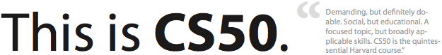

*Edition: September 2013*

Introduction to the intellectual enterprises of computer science and the art of
programming. This course teaches students how to think algorithmically and
solve problems efficiently. Topics include abstraction, algorithms, data
structures, encapsulation, resource management, security, software engineering,
and web development. Languages include C, PHP, and JavaScript plus SQL, CSS,
and HTML. Problem sets inspired by real-world domains of biology, cryptography,
finance, forensics, and gaming. Designed for concentrators and
non-concentrators alike, with or without prior programming experience.

## Staff

To contact the course's staff about almost anything, feel free to e-mail
<help@mprog.nl>. We'll usually respond within 24 hours.

### Instructor

For personal matters and special arrangements.

Martijn Stegeman  
<stegeman@uva.nl>  
room: C3.204  
phone: 525 5235

## Goals for this course

TBA

## Prerequisites

None -- definitely no programming experience needed.

## Expectations

You are expected to watch all lectures and sections, submit eight problem sets,
take two quizzes, and submit a final project.

You are required to work in the lab for some amount of time during the week,
as agreed upon with the course coordinator. During these hours, teaching
assistants are available to answer any questions you may have about the
lectures, quizzes or problem sets.

## Grades

You will receive a final grade for the course if:

* you've attended all lab sessions during the course;
* you've submitted every problem set working and on time;
* you've passed the quizzes.

Should you not have succeeded in doing one of those, we cannot give you a
final grade. Still, we are most certain that every student should be able to
pass the course!

The grade of **Part 1** will be determined using the following weights:

* Problem Sets 0--4: 100%
* Quiz 0: 0% (but needs to be passed)

The grade of **Part 2** will be determined using the following weights:

* Problem Sets 5--7: 60%
* Final Project: 40%
* Quiz 1: 0% (but needs to be passed)

Know that this course draws quite the spectrum of students, including "those
less comfortable", "those more comfortable", and those somewhere in between.
However, what ultimately matters in this course is not so much where you end
up relative to your classmates but where you end up relative to yourself
in Week 0.

The course is not graded on a curve. The course does not have pre-determined
cutoffs for final grades. Those less comfortable and somewhere in between are
not at a disadvantage vis-à-vis those more comfortable. Each student's final
grade is individually determined at term's end after input from the teaching
fellows. Remarkable effort and upward trending do not go unnoticed.

## Books

No books are required for this course. However, we do have a number of books
available for you to read during office hours. You are welcome to pick up one
of these and read them as a preparation for or review of one of the lectures.

For those who would like to have their own book, here are some good
suggestions:

> **For Those Less Comfortable**
> 
> Absolute Beginner’s Guide to C, Second Edition  
> Greg Perry  
> Sams Publishing, 1994  
> ISBN 0-672-30510-0
> 
> **For Those More Comfortable**
> 
> Programming in C, Third Edition  
> Stephen Kochan  
> Sams Publishing, 2004  
> ISBN 0-672-32666-3

The book below is recommended for those interested in understanding how their
own computers work for personal edification.

> How Computers Work, Ninth Edition
> Ron White  
> Que Publishing, 2007  
> ISBN 0-7897-3613-6

This last book below is recommended for aspiring hackers, those interested in
programming tricks and low-level optimization of code for applications beyond
the scope of this course.

> Hacker's Delight  
> Henry S. Warren Jr.  
> Addison-Wesley, 2003  
> ISBN 0-201-91465-4
